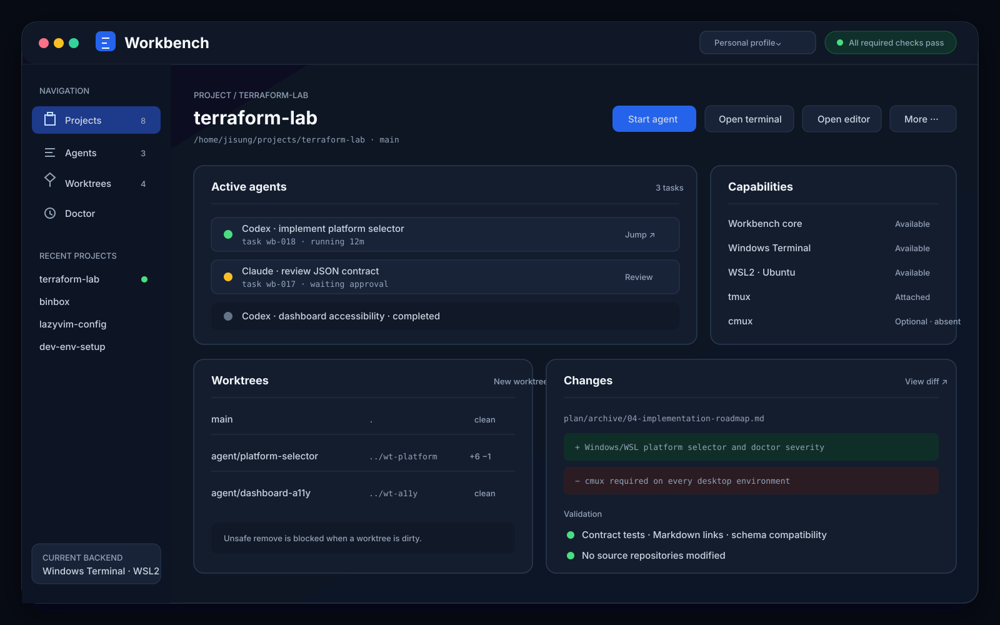

# UI와 client 사양

## 결론

UI는 별도 state owner가 아니다. 모든 UI는 `wb` command 또는 local API를 호출하는 client다.

구현 순서:

1. cmux/Windows Terminal action과 LazyVim picker
2. `wb dashboard` localhost Web UI
3. 필요가 검증되면 Tauri/SwiftUI wrapper

앞서 논의한 full Workbench 와이어프레임은 2번 Dashboard의 목표 화면이다. 처음부터 독립 desktop
tool로 설치하는 것을 의미하지 않는다.

## 공통 정보 구조

```text
Projects
├─ Agents & tasks
├─ Worktrees
├─ Changes / tests
└─ Project actions

Global
├─ Running/waiting agents
├─ Sessions by backend
├─ Doctor/capabilities
└─ Profiles/settings
```

## Dashboard 와이어프레임



위 이미지는 desktop 폭의 목표 정보 구조다. cmux browser, Windows 기본 browser, 일반 browser가 같은
Dashboard를 표시하며 terminal backend의 차이는 capability와 action에만 반영한다. 아래 ASCII 버전은
이미지를 열 수 없는 terminal 환경을 위한 대체 표현이다.

```text
┌──────────────────────────────────────────────────────────────────────────┐
│ Workbench                          local · cmux backend · personal profile│
├──────────────────┬──────────────────────────────────────┬────────────────┤
│ PROJECTS         │ terraform-lab                        │ SELECTED TASK  │
│                  │ ~/home/lab/... · feat/rds-monitoring │                │
│ ● terraform-lab │ [Open tmux] [Open LazyVim] [+ Agent] │ Codex          │
│   2 agents       ├──────────────────────────────────────┤ running        │
│ ○ binbox         │ ACTIVE AGENTS                        │ task-104       │
│ ○ lazyvim-config│ ┌────────────────┐ ┌───────────────┐ │ cmux tab      │
│ ○ notes          │ │ Codex running  │ │ Claude waiting│ │ .worktrees/rds│
│                  │ │ implementation │ │ plan approval │ │                │
│ VIEW             │ └────────────────┘ └───────────────┘ │ [Jump]         │
│ ● Agents & tasks │                                      │ [View diff]    │
│ ○ Worktrees      │ RECENT EVENTS                        │ [Run tests]    │
│ ○ Changes        │ ✓ validate · approval requested ...  │ [Stop task]    │
└──────────────────┴──────────────────────────────────────┴────────────────┘
```

화면 역할:

- 왼쪽: project 선택과 project-local view 전환
- 가운데: 선택 project의 Agent, worktree, change, test 상태
- 오른쪽: 선택 task/worktree의 상세와 제한된 action
- 상단: 현재 profile/backend와 project open action

## Dashboard 실행 방식

```bash
wb dashboard
wb dashboard --open cmux
wb dashboard --open browser
wb dashboard --open none --port 0
```

기본 동작:

1. loopback port 확보
2. local API와 static UI 시작
3. `--open`에 따라 cmux browser 또는 기본 browser 열기
4. process 종료 시 listener 종료

초기에는 background daemon으로 자동 전환하지 않는다. 장시간 dashboard가 필요하면 사용자가 명시적으로
process supervisor 또는 tmux session에서 실행한다.

## Dashboard 화면 정의

### Projects

표시:

- name, path, active profile
- Git branch와 dirty 여부
- active session/Agent/worktree 수
- backend availability

action:

- Open with default backend
- Open with cmux/tmux/shell
- Open with Windows Terminal/WSL
- Open LazyVim
- Start Agent

### Agents & tasks

표시:

- stable task ID
- Agent 종류
- running/waiting/idle/completed/failed/stopped
- project/worktree
- backend와 backend reference
- last event time

action:

- Jump
- View diff
- Run registered test workflow
- Stop

waiting state는 색상만으로 표현하지 않고 label과 shape/icon을 함께 사용한다.

### Worktrees

표시:

- branch, path, base ref
- owner human/Agent
- dirty/change count
- linked task

action:

- Create from registered project
- Open
- Compare
- Remove; dirty이면 거부하고 이유 표시

### Changes

표시:

- changed files와 add/delete count
- test/lint/validate 결과
- Agent별 변경 attribution은 명시적으로 기록된 task/worktree만 표시

초기 UI에서 full IDE diff editor를 만들지 않는다. 기존 `git diff`, LazyVim, cmux terminal로 이동시키는
action을 제공한다.

### Doctor

표시:

- core, optional capability 구분
- cmux/tmux/binbox/git/nvim/Agent CLI version과 availability
- repo/link/schema/lock 상태
- recovery command

## cmux client

cmux는 다음 command/action을 제공한다.

```text
Open Workbench Dashboard
Open Project
Start Codex
Start Claude
Show Agents
Create Worktree
Run Doctor
```

권고 구현:

- global base action은 `cmux-config/config.d`에 유지
- project/workflow action은 `wb` manifest에서 generated fragment로 생성
- action은 `wb` command ID를 호출하고 `bb`/Git command를 직접 중복 조립하지 않음
- project별 특수 layout은 project `.cmux/cmux.json`에 유지

cmux가 없을 때 core 동작이 실패해서는 안 된다. cmux action 생성과 `--backend cmux`만 unavailable로
처리한다.

## Windows Terminal client/backend

Windows Terminal에서는 별도 embedded Workbench panel을 먼저 만들지 않는다. 다음 세 경로를 제공한다.

```text
PowerShell  → wb.exe command/TUI → wt.exe tab/pane
WSL shell   → Linux wb command   → tmux 또는 wt.exe WSL profile
Dashboard   → default Windows browser on localhost
```

제공 action:

```text
Open Project in Windows Terminal
Open Project in WSL
Open/attach tmux session in WSL
Start Codex/Claude in selected profile
Open Workbench Dashboard in browser
Run Doctor
```

`wt.exe`는 UI backend일 뿐 source of truth가 아니다. Windows Terminal settings/profile을 Workbench가
전면 관리하지 않고 profile name 또는 GUID를 machine-local profile 설정에서 참조한다.

Windows에서는 cmux와 같은 in-app browser를 가정하지 않는다. `wb dashboard --open browser`가 기본
browser를 사용하며, terminal에서는 Dashboard URL과 상태를 출력한다.

## LazyVim client

초기에는 `lazyvim-config/lua/workbench/`에 구현하고, 독립 release/test 필요가 생기면
`workbench.nvim` repo로 분리한다.

명령:

```vim
:WorkbenchProjects
:WorkbenchAgents
:WorkbenchWorktrees
:WorkbenchDoctor
```

첫 release는 command와 picker만 제공하고 default keymap을 추가하지 않는다. 실제 반복 사용이 확인된
command만 기존 mapping 충돌 검사 후 별도 변경으로 keymap을 추가한다.

동작:

- `vim.system({ "wb", ... , "--json" })`처럼 argument 배열로 실행
- timeout과 non-zero exit를 사용자에게 설명
- JSON schema version 불일치 시 upgrade guidance
- `wb`가 없을 때 기존 project picker/sessionizer parser fallback
- UI thread를 block하지 않음

## 일반 shell과 tmux UI

GUI가 없어도 다음이 완전한 fallback이다.

```bash
wb projects list
wb agents list
wb open <project> --backend tmux
wb doctor
```

선택적으로 `wb tui`를 추가할 수 있지만 Dashboard와 기능 중복이 확인되기 전에는 범위에 포함하지 않는다.
현재 `bb agents` popup은 migration 기간 동안 유지한다.

## 향후 Desktop 앱

다음 요구가 반복될 때만 별도 app을 만든다.

- cmux 없이 상시 Agent 상태 표시
- menu bar/native notification/auto start 필요
- 여러 repo diff를 한 화면에서 비교
- Dashboard process lifecycle을 사용자가 관리하기 어려움

Desktop app도 새로운 shell backend를 만들지 않고 같은 local API를 사용한다.

## 접근성과 responsive 기준

- keyboard만으로 project, Agent, action을 선택 가능
- 상태를 색상 하나로만 구분하지 않음
- 320px 폭에서는 sidebar → main → detail 순으로 stack
- 긴 path/branch는 생략 표시하되 full value 접근 가능
- destructive action은 대상과 결과를 명확히 표시
- running list가 길어져도 selected item과 현재 action을 잃지 않음

## UI 보안 경계

- listen은 loopback-only
- state file/token/secret 원문 표시 금지
- arbitrary shell text field 금지
- registered command ID와 typed arguments만 허용
- destructive action은 backend에서 재검증; UI 확인만 신뢰하지 않음
- browser origin과 local API 요청 검증
