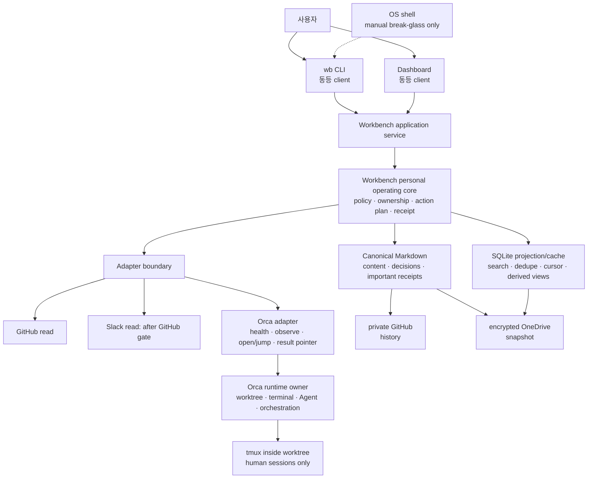

# Setup 목표 아키텍처

> 상태: **Phase 0 결정 기준선**  
> 기준일: 2026-08-10  
> 범위: 제품 경계, component ownership, canonical data, 실행 surface와 data flow  
> 상위 결정: [PRODUCT-PLAN.md](PRODUCT-PLAN.md)  
> Dashboard target contract: [DASHBOARD-SPEC.md](DASHBOARD-SPEC.md)
> 전달 순서: [IMPLEMENTATION-ROADMAP.md](IMPLEMENTATION-ROADMAP.md)

## 1. 목적과 해석 규칙

Setup은 여러 장비에서 개인 업무와 개발 맥락을 준비하고, 이어가고, 복구하는 local-first 개인 운영
환경이다. **Workbench는 그 개인 운영 core**이며, `wb` CLI와 Dashboard는 같은 core contract를 사용하는
동등한 client다. **Orca는 기본 cross-platform terminal/Agent workspace**다.

이 문서는 목표 구조를 정의하며 현재 구현을 완료된 기능처럼 표현하지 않는다.

- **현재**는 2026-08-10 checkout의 코드와 문서에서 검증한 사실이다.
- **계획**은 이 문서와 roadmap에서 새로 채택한 목표다.
- **실험**은 acceptance gate 전에는 지원 기능이 아니다.
- child repository의 상세 CLI, schema와 안전 계약은 각 child README/docs가 계속 소유한다.

문서 ownership도 층을 나눈다. `PRODUCT-PLAN.md`는 제품 방향과 성공 지표, 이 문서는 system ownership과
data/runtime invariant, `DASHBOARD-SPEC.md`는 Dashboard IA·interaction·responsive/accessibility target,
`IMPLEMENTATION-ROADMAP.md`는 dependency와 delivery gate를 소유한다. Dashboard 명세의 `Phase 0–4`는 UX
workstream 이름이며 delivery DAG의 `S0–S9`를 대체하지 않는다.

## 2. 확정된 아키텍처 결정

1. Workbench는 optional observer가 아니라 개인 운영의 논리적 core다. 단, 장애 시 어떤 사용 가능한
   shell에서도 Markdown, Git과 `wb`로 읽고 복구할 수 있는 수동 경로를 막지 않는다.
2. `wb` CLI와 Dashboard는 동등한 first-party client다. 한쪽에만 존재하는 domain capability는 완료로
   보지 않으며, platform 제약으로 UI 동작이 다르면 같은 plan/receipt와 명시적 handoff를 제공한다.
3. Orca는 WSL, macOS와 이후 검증된 platform에서 기본 terminal/Agent workspace다. Workbench는 Orca의
   worktree, terminal, Agent, Run/Task/Dispatch lifecycle을 복제하지 않는다.
4. Workbench는 Windows Terminal과 iTerm2를 별도 backend, bootstrap 또는 recovery surface로 통합하지
   않는다. WSL과 macOS의 제품 workspace는 Orca 하나이며 OS별 terminal 차이는 Orca 아래의 구현 세부다.
5. tmux는 각 Orca worktree **안에서** 사람이 session/window/pane을 분리하는 계층으로 유지한다. Orca가
   관리하는 Agent는 tmux 밖의 Orca Agent terminal에서 실행한다. 따라서 tmux pane scraping은 Orca Agent
   lifecycle의 근거가 아니다.
6. cmux는 신규 제품 경로에서 제외한다. 이미 존재하는 호환 구현과 문서는 즉시 파괴적으로 삭제하지 않고
   migration 및 사용 증거를 확인한 뒤 별도 deprecation 단계에서 처리한다.
7. Markdown은 사람이 작성하고 LLM이 소비하는 task, note, decision, plan, runbook과 중요한 receipt의
   canonical format이다. SQLite는 삭제 후 재구축 가능한 projection/cache다.
8. operational state는 무조건 SQLite에 넣지 않고 authority와 복구 성질로 분류한다. 재구축 불가능한
   checkpoint, approval, mutation receipt는 canonical Markdown 또는 별도 portable journal을 먼저 남긴다.
9. 첫 외부 read adapter는 GitHub, 두 번째는 Slack이다. Slack은 GitHub에서 provenance, cursor,
   reconcile, health, disable/export 계약이 재사용된 뒤에만 시작한다.
10. private GitHub는 Markdown과 설정 history를 보존한다. encrypted OneDrive snapshot은 runtime state와
    attachment를 포함한 off-device recovery에 사용한다. 같은 working tree를 두 provider가 동시에 sync하지
    않는다.

## 3. 현재와 계획의 차이

| 영역 | 현재 구현/검증 | 계획된 목표 | 완료로 오해하면 안 되는 것 |
|---|---|---|---|
| Workbench 역할 | project/environment/secret/session/worktree/Agent/workflow registry와 loopback Dashboard | personal operating core: Context, Inbox, Project, Task, ExternalRef, WorkLocation, Run, policy | 현재 registry가 새 canonical model을 이미 구현했다는 주장 |
| client 관계 | CLI가 넓은 command surface, Dashboard가 snapshot과 제한된 typed action 제공 | CLI와 Dashboard가 동일 application service의 동등 client | 화면에 button이 있다고 contract parity가 증명된 것 |
| 기본 workspace | backend auto 선택; tmux 우선 보존, cmux/Windows Terminal/shell adapter 존재 | Orca가 유일한 cross-platform 제품 workspace | 현재 Workbench에 Orca adapter가 존재하거나 기존 adapter 제거가 끝났다는 주장 |
| tmux | managed project session과 Agent/workflow pane의 runtime owner 역할도 수행 | Orca worktree 안의 **human-only** session/window/pane 분리 | 기존 Workbench managed Agent를 즉시 삭제하거나 migration 없이 중단하는 것 |
| Agent | Workbench가 Codex/Claude task registry와 tmux/cmux launch 일부를 소유 | Orca가 Agent와 orchestration runtime을 단독 소유; Workbench는 opaque ref/result pointer만 보유 | tmux foreground command를 Orca Agent 상태로 추론하는 것 |
| native terminal | Windows Terminal launch backend 구현; iTerm2 전용 contract 없음 | 신규 integration 없음; OS terminal은 Orca 아래의 비소유 구현 세부 | 기존 Windows Terminal adapter가 이미 제거됐다는 주장 |
| cmux | macOS optional backend/client, mocked contract 중심 | 신규 제품 경로에서 제외; 안전한 deprecation은 후속 | 기존 구현의 즉시 삭제 승인 |
| 저장 | schema-v1 TOML/JSON registry, bounded activity/workflow history, backup | Markdown canonical + rebuildable SQLite projection/cache + classified operational journal | 전면 SQLite migration 또는 DB file sync |
| 외부 adapter | file/Git 일부 관찰 기능; GitHub/Slack product adapter 없음 | GitHub read 후 Slack read | write connector, webhook, generic plugin SDK |
| backup | registry별 local backup; off-device restore 미검증 | private GitHub history + encrypted OneDrive snapshot, restore drill | 평문 Secret backup 또는 동일 directory 이중 sync |

기존 안전 계약—managed/observed 분리, Git/tmux 재검증, typed action, argument-array 실행, backup, partial
failure 보존, loopback Dashboard—은 폐기 대상이 아니라 새 core로 가져갈 기준선이다.

## 4. 논리 구성과 ownership



| component | 단독 소유 책임 | 소유하지 않는 것 |
|---|---|---|
| root setup | repo/profile 선택, provisioning, prerequisites, verified manifest, aggregate doctor, restore entrypoint | child 기능, 사용자 content, live workspace lifecycle |
| Workbench core | long-lived personal model, context/policy, stable local IDs, action plan, receipt classification, adapter orchestration | provider 원문, Git/tmux/Orca 실체, credential plaintext |
| application service | client-neutral query/command contract, validation, authorization, transaction/checkpoint boundary | browser-only 또는 CLI-only business rule |
| `wb` CLI | scripting, capture, query, plan/apply, export, backup/restore, recovery UX | 별도 state 또는 별도 mutation semantics |
| Dashboard | overview, Today/review, relation 탐색, plan/diff, foreground approval, recovery visibility | 별도 registry, browser-side source parsing, arbitrary shell |
| Orca | worktree, terminal, Agent session, Run/Task/Dispatch, remote/local runtime lifecycle | Workbench의 장기 personal Task와 canonical content |
| tmux | Orca worktree 안에서 사람의 persistent session/window/pane | Orca Agent launch/status, cross-worktree control plane |
| OS shell | Orca 장애 시 문서화된 수동 `wb`/Markdown/Git break-glass | 제품 workspace, 자동 terminal 선택·실행, canonical state |
| Windows Terminal/iTerm2/cmux | 신규 제품 ownership 없음; 기존 adapter는 deprecation 전까지 compatibility 이력 | 목표 workspace와 신규 기능 |
| file/Git adapter | local Markdown discovery, Git fact/read projection | core policy와 provider mutation authority |
| GitHub/Slack adapter | provider ID, scope, cursor, health, read projection, deep link, disable/export | provider 원문과 초기 write |
| private GitHub | canonical Markdown/config history and review | runtime DB, Secret, live lock/queue |
| encrypted OneDrive snapshot | off-device point-in-time recovery copy | live sync, merge authority, plaintext Secret |

## 5. client parity contract

동등 client는 동일한 화면을 뜻하지 않고 동일한 domain outcome을 뜻한다.

1. 모든 mutation은 core가 생성한 stable `action_id`, typed input, target, risk, plan hash와 checkpoint를 쓴다.
2. CLI와 Dashboard는 같은 validation, policy decision, execute/reconcile code path를 호출한다.
3. 두 client 모두 preview, effective context/account, stale 상태, outcome, surviving asset, recovery hint와 receipt
   location을 보여준다.
4. interactive terminal이 필요한 action은 Dashboard가 흉내 내지 않는다. 동일 plan을 만든 뒤 exact
   `wb ... --action-id ...` handoff를 제공하고 receipt는 같은 action에 귀속한다.
5. automated parity test는 같은 fixture와 action을 두 client adapter에 통과시켜 plan hash, state transition,
   error code와 receipt schema가 같은지 확인한다.
6. Dashboard는 매 stage에 deliverable이 있으며, CLI 뒤에 무기한 미루는 별도 frontend phase를 두지 않는다.

## 6. canonical data와 operational state 분류

### 6.1 분류표

| class | 예 | authority | 저장/backup 계약 |
|---|---|---|---|
| C1 canonical human/LLM content | task, note, decision, plan, runbook, review packet | Markdown file + stable ID | private GitHub history, encrypted snapshot |
| C2 important receipt | approval, destructive plan hash, mutation outcome, checkpoint/recovery instruction | append-oriented Markdown/portable journal | Git에는 민감값 제거본만; encrypted snapshot에 보존 |
| C3 portable declaration | profile, adapter enable/scope, project mapping, policy | versioned TOML/JSON/Markdown | Git history; migration + export/import |
| O1 authoritative local operational state | pending mutation, idempotency/fencing key, ownership grant, unreconciled outcome | Workbench transactional journal; canonical receipt와 연결 | crash-safe snapshot, explicit retention, restore test; 단순 rebuild 금지 |
| O2 provider-authoritative projection | GitHub/Slack metadata, Orca observed state, Git facts | provider/Git/Orca | SQLite cache; `observed_at`, cursor, confidence; rebuild 가능 |
| O3 derived projection/cache | search, FTS, dedupe candidates, Today counts, backlinks | C1–C3/O1/O2에서 파생 | SQLite; delete/rebuild가 정상 recovery |
| secret | token, age key, credential | OS/provider vault 또는 별도 age boundary | 일반 Markdown/SQLite/Git/log 금지; reference와 availability만 |

SQLite를 “rebuildable”이라고 부르려면 O1이 DB 안에만 남아서는 안 된다. O1 record는 durable portable
journal/checkpoint로 먼저 확정하거나, 별도의 authority store로 명시하고 DB rebuild가 그 record를 재생할 수
있어야 한다. `PRODUCT-PLAN.md`와 Dashboard 명세에서 말하는 SQLite `run journal`은 C2/O1 authority가 아니라
그 receipt/journal을 찾고 query하기 위한 projection을 뜻한다. 어떤 state도 분류 없이 `workbench.db`에
추가하지 않는다.

### 6.2 최소 canonical object

MVP는 `Context`, `InboxItem`, `Project`, `Task`, `ExternalRef`, `WorkLocation`, `Run`만 고정한다. 모든
Markdown object는 최소한 stable ID, kind, context, status, created/updated time과 schema version을 가지되
frontmatter 세부 필드는 prototype과 migration fixture를 통과한 뒤 확정한다.

Workbench Task와 Orca Task는 다른 객체다. 관계는 다음처럼 명시한다.

```text
Workbench Task/Run
  └─ WorkLocation(provider=orca, external refs, observed_at, confidence)
       └─ result pointers(files, tests, commit/PR, remaining work)
```

prompt, transcript, terminal handle은 기본 canonical record가 아니다. transcript 보존은 작업별 opt-in,
retention과 sensitivity가 있을 때만 허용한다.

## 7. 주요 data flow

### 7.1 local capture → review → resume

1. CLI 또는 Dashboard가 input과 `Context`를 core에 제출한다.
2. core가 stable ID/provenance를 포함한 Markdown을 staged write하고 schema를 검증한다.
3. filesystem adapter가 change를 관찰하고 SQLite projection을 갱신한다.
4. Today/Inbox/Project query를 두 client가 같은 projection revision으로 읽는다.
5. resume은 `WorkLocation`을 provider에서 재검증한다. Orca 대상은 Orca로, recovery 대상은 native
   terminal/tmux/Git 경로로 연다.
6. 결과와 중요한 recovery 정보는 canonical receipt에 남고 projection은 다시 rebuild 가능하다.

### 7.2 Orca workspace와 human tmux

1. Workbench는 canonical repo/path/branch와 capability/version을 확인하고 Orca open/jump를 요청한다.
2. Orca가 worktree와 terminal/Agent identity를 소유한다.
3. 사람이 긴 작업을 분리할 때 해당 Orca worktree terminal 안에서 tmux session/window/pane을 연다.
4. Orca-managed Agent는 Orca의 Agent terminal에서 tmux 밖에 시작한다.
5. Workbench는 opaque Orca reference, `observed_at`, confidence와 result pointer만 저장한다. runtime handle은
   재시작 때 다시 찾으며 stop/remove는 초기 범위가 아니다.

### 7.3 GitHub → Slack read adapter

```text
provider poll/API → source event envelope → dedupe/idempotency
  → staged projection → cursor commit → Today/Inbox query
  → periodic reconcile → stale/partial/health 표시
```

provider notification이 생겨도 hint일 뿐이다. cursor와 reconcile이 completeness 기준이다. GitHub에서
duplicate, cursor reset, revoke, wrong account/context, export와 disconnect를 통과하기 전에는 Slack을
시작하지 않는다.

### 7.4 history와 snapshot recovery

1. canonical Markdown/config 변경은 private GitHub working tree에서 review/commit한다.
2. SQLite, attachments, portable journal과 manifest는 임시 staging directory에 모은다.
3. Secret 값을 제외하고 archive를 암호화한 뒤 OneDrive snapshot location으로 복사한다.
4. hash/schema/manifest를 검증하고 snapshot receipt를 canonical journal에 남긴다.
5. restore는 clean temporary location → decrypt → checksum/schema → projection rebuild → doctor 순서로
   검증한다. live Git working tree에 OneDrive sync를 직접 걸지 않는다.

## 8. failure, security와 recovery invariants

- 상태는 `received → staged → applied → reviewed`와 `blocked`, `retryable`, `partial`, `unknown`을 구분한다.
- external write와 destructive action은 source revision, exact target, ownership과 effective permission을 직전에
  재검증한다.
- timeout 뒤 write를 자동 재시도하지 않고 provider를 reconcile한다.
- Secret plaintext는 argv, prompt, Markdown, SQLite, Dashboard snapshot, activity/audit에 넣지 않는다.
- managed와 observed를 분리하며 관찰 사실로 stop/delete 권한을 만들지 않는다.
- Orca 부재나 incompatible capability에서는 자동으로 다른 terminal을 launch하지 않는다. 사용자가 현재
  접근 가능한 shell에서 문서화된 `wb`/Markdown/Git break-glass 절차를 명시적으로 실행한다.
- Dashboard는 loopback, runtime token, same-origin, typed payload와 bounded input을 유지한다.
- 중요한 mutation 전 cutoff checkpoint를 만들고, partial failure는 살아 있는 asset과 exact next action을
  receipt에 남긴다.

## 9. 구조적 중단선

다음 중 하나가 발생하면 해당 expansion을 중단하고 이전 checkpoint로 돌아간다.

- CLI와 Dashboard가 서로 다른 state owner 또는 mutation semantics를 필요로 한다.
- Orca integration이 transcript scraping, terminal-handle 영구 저장 또는 Workbench의 Run/Task/Dispatch 복제를
  요구한다.
- tmux 안에 Orca-managed Agent를 넣어야만 lifecycle을 추적할 수 있다.
- SQLite 삭제/rebuild 뒤 canonical content, important receipt 또는 O1 operational state가 사라진다.
- GitHub/OneDrive가 같은 path를 동시 sync하거나 plaintext Secret이 backup/history에 나타난다.
- Slack 구현을 위해 GitHub와 무관한 generic plugin framework를 먼저 만들어야 한다.
- direct Git/Markdown/`wb` break-glass path가 Workbench/Orca 장애 때문에 동작하지 않는다.

이 경우 기능 수를 줄이는 것은 실패가 아니라 ownership과 복구 계약을 지키는 설계 선택이다.
