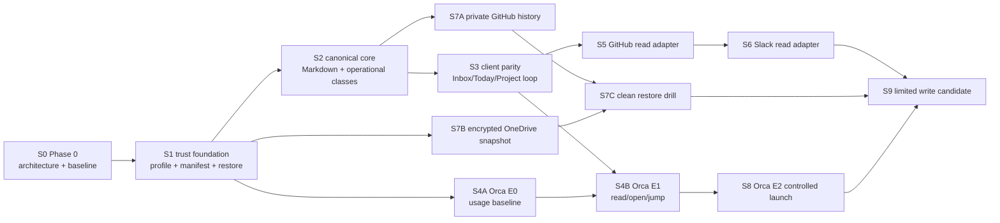

# Setup staged implementation roadmap

> 상태: **Phase 0 delivery plan**  
> 기준일: 2026-08-10  
> 아키텍처: [ARCHITECTURE.md](ARCHITECTURE.md)  
> Dashboard workstream: [DASHBOARD-SPEC.md](DASHBOARD-SPEC.md)
> 제품 gate: [PRODUCT-PLAN.md](PRODUCT-PLAN.md)

## 1. delivery 원칙

로드맵은 날짜만으로 승격하지 않고 dependency, evidence와 stop criteria로 진행한다. 각 stage는 CLI,
Dashboard, data/recovery, validation 전달물을 함께 갖는다. stage가 끝날 때 current facts, planned next step,
검증 artifact와 rollback point를 checkpoint로 고정한다.

- WSL은 primary Tier-1 후보이며 macOS는 같은 smoke track에서 독립 판정한다.
- root와 child repo ownership을 지킨다. root는 profile/manifest/integration contract, Workbench는 core/clients,
  nvim/binbox는 terminal/editor fallback, cmux-config는 optional compatibility를 소유한다.
- 첫 external read adapter는 GitHub, 다음은 Slack이다.
- Orca는 기본 workspace 목표지만 E0/E1 gate를 통과하기 전에는 현재 구현 기능이라고 부르지 않는다.
- 한 stage의 Dashboard는 후속 polish가 아니라 acceptance 대상이다.

## 2. staged DAG



Critical path는 `S0 → S1 → S2 → S3 → S5 → S6`이다. S4A와 backup 두 branch는 선행조건이 충족되면
병행할 수 있지만, 같은 file owner를 공유하는 implementation task는 병렬 edit하지 않는다. S8과 S9는
30일 MVP 밖의 조건부 stage다. `PRODUCT-PLAN.md`의 30/90일 horizon이나 마지막 scope 순서가 이 DAG와 다르게
읽히면 이 문서의 dependency가 실행 순서를 소유한다. 특히 Orca E0(S4A)는 Slack 뒤에 기다리는 작업이 아니라
S1 뒤 S2/S3과 병행해 표본을 모으며, E1(S4B)만 S3과 E0 promotion을 모두 기다린다.

### Dashboard Phase 0–4와 delivery DAG의 관계

`DASHBOARD-SPEC.md`의 Phase는 UX workstream 묶음이고 이 문서의 dependency gate를 압축하거나 건너뛰지
않는다.

| Dashboard phase | delivery stage mapping | dependency/해석 |
|---|---|---|
| Phase 0 결정·계약 | S0 | 명세, compatibility map과 gap report만 완료한다. v2 route/action은 구현 완료가 아니다. |
| Phase 1 Core parity·compatibility shell | S1의 System & Recovery slice + S3 client-parity foundation | nav/alias/common state는 S0 뒤 시작할 수 있지만 canonical mutation parity는 S2 data contract 뒤 S3에서 accept한다. |
| Phase 2 local closed loop | S2 → S3, workspace는 S4A → S4B, off-device restore는 S7A/S7B → S7C | 한 번에 release하는 단일 phase가 아니다. 각 card/action은 underlying stage gate를 통과한 capability만 노출한다. |
| Phase 3 external read connector | S5 → S6 | GitHub acceptance 전 Slack code와 UI를 시작하지 않는다. |
| Phase 4 controlled execution·limited write | S8 및 별도 S9 | S8은 S4B+S7C 뒤, S9는 S6+S7C(Agent write면 S8도) 뒤다. 두 기능을 같은 승격으로 묶지 않는다. |

모든 Dashboard slice는 명세의 loading/empty/stale/partial/blocked/unknown/unavailable state, WCAG 2.2 AA,
360/768/1280px responsive, keyboard/focus와 current v1 security/compatibility regression을 해당 stage의
acceptance에 포함한다. planner 명세가 화면과 interaction의 source이고 이 roadmap은 언제 claim할 수 있는지를
정한다.

## 3. 모든 stage에 적용하는 definition of done

1. **Contract:** owner, input/output, current/planned 문구와 failure state가 문서화됐다.
2. **CLI:** query 또는 action을 automation/SSH에서도 수행하고 machine-readable result를 얻는다.
3. **Dashboard:** 같은 core query/action의 stage-specific view, stale/error/recovery state를 제공한다.
4. **Parity:** 같은 fixture에서 CLI와 Dashboard가 같은 action plan, outcome/error code와 receipt를 만든다.
5. **Recovery:** disable/export와 checkpoint/rollback 또는 rebuild 경로를 검증했다.
6. **Security:** Secret/context/authority negative test를 통과했다.
7. **Evidence:** build, fixture, 실제 장비 smoke를 구분한 validation record가 있다.
8. **Cutoff:** stage checkpoint가 기록되고 미완료 항목은 다음 stage로 암묵적으로 넘어가지 않는다.

## 4. stage별 deliverable과 gate

### S0 — Phase 0 architecture와 baseline

**목표:** 결정을 잠그고 구현 팀이 충돌 없이 task를 자를 수 있게 한다.

**Deliverables**

- 이 architecture와 roadmap, component ownership 및 staged DAG.
- 기존 Workbench package/CLI/Dashboard/file boundary의 current-state inventory.
- Workbench core, `wb`, Dashboard, root setup, Orca, tmux, native terminal, cmux의 owner matrix.
- data classification(C1–C3, O1–O3, Secret)과 current-vs-planned wording rule.
- Dashboard: 현재 route/action inventory를 새 IA(Today, Inbox, Projects, Runs, Integrations, Recovery)에 mapping한
  read-only gap report. 구현 변경은 S0에 포함하지 않는다.

**Acceptance**

- coordinator brief의 모든 결정이 architecture에 명시돼 있다.
- dependency depth가 4 이하인 task DAG로 S1–S3을 분해할 수 있다.
- planner/backend/frontend owner가 같은 file을 동시에 수정하지 않는 change map이 준비된다.

**Stop**

- Workbench/Orca/tmux 중 live Agent lifecycle의 mutation owner를 하나로 정할 수 없으면 S1 이후 Agent 작업을
  시작하지 않는다.
- SQLite에 둘 operational state의 authority를 분류하지 못하면 schema implementation을 시작하지 않는다.

### S1 — trust foundation와 recovery shell

**목표:** 새 domain 전에 설치, native recovery와 검증 조합을 신뢰할 수 있게 한다.

**Dependencies:** S0.

**Root/setup deliverables**

- default `workbench` profile과 explicit `terminal` recovery profile의 selector/preflight/exit contract 정렬.
- WSL에서 Windows Terminal, macOS에서 iTerm2를 쓰는 bootstrap/doctor/restore runbook.
- child commit, platform, date, validation run, expiry(90일), rollback을 가진 verified manifest.
- dirty child preservation, no-force update, synthetic corruption restore fixture.

**Workbench/clients deliverables**

- CLI: `doctor`, portable inventory, backup/verify/restore dry-run의 기준 contract.
- Dashboard: System & Recovery view에 profile, capability tier, manifest freshness, last verified checkpoint,
  recovery command를 표시. install/repair 자동 실행은 하지 않는다.

**Acceptance**

- WSL fresh setup + doctor 2회, update 2회, synthetic restore 1회.
- macOS는 같은 smoke를 별도 결과로 기록; 미통과면 experimental 표기.
- Workbench/Orca 없이 native terminal에서 Markdown/Git/tmux fallback 진입 성공.
- profile 문서, selection output과 exit code가 일치.

**Stop/cutoff**

- 수동 삭제, force Git 또는 사용자 dirty state 손실이 필요하면 모든 새 기능을 동결한다.
- manifest input이 하나의 검증 run에서 나오지 않았거나 rollback이 없으면 stage를 닫지 않는다.

### S2 — canonical Markdown core와 operational state

**목표:** connector 없이 portable personal model과 rebuildable projection을 증명한다.

**Dependencies:** S1.

**Core/data deliverables**

- `Context`, `InboxItem`, `Project`, `Task`, `ExternalRef`, `WorkLocation`, `Run`의 최소 Markdown schema.
- stable ID, rename/link, schema migration, concurrent edit와 corrupt/truncated fixture.
- C1–C3/O1–O3 classification enforcement; unclassified state 추가를 CI에서 거부하는 schema review checklist.
- SQLite projection/cache: lexical search, dedupe candidate, Today query, source/observed time; delete/rebuild command.
- important receipt와 O1 checkpoint를 portable journal에 먼저 확정한 뒤 projection하는 write protocol.

**CLI deliverables**

- capture/import, show/search, projection rebuild, export/import, receipt inspect.
- rebuild 전/후 record count, stable ID, hash와 query equivalence 검증.

**Dashboard deliverables**

- read-only Inbox/Today/Project skeleton, projection freshness, rebuild status와 canonical file link.
- Markdown parse error를 숨기지 않고 file/field/recovery guidance를 보여준다.
- 새 IA shell과 common state component는 schema-ready capability만 enable하고, 준비되지 않은 v2 query/action은
  unavailable/준비 중으로 표시한다. 현재 v1 deep link와 typed action을 자동으로 제거하거나 재노출하지 않는다.

**Acceptance**

- SQLite와 sidecar를 삭제한 clean rebuild 뒤 canonical object와 important receipt 유실 0.
- export→clean import→rebuild 후 stable relation 100% 유지.
- Secret fixture가 Markdown, SQLite, search result, logs와 Dashboard snapshot에 나타나지 않음.
- personal/work cross-context write는 기본 fail-closed.

**Stop/cutoff**

- frontmatter rename이 stable link를 보존하지 못하거나 O1을 DB 없이는 복구할 수 없으면 schema를 동결하지
  않고 prototype으로 되돌린다.
- 전면 SQLite migration이 필요해지면 별도 decision gate 없이 진행하지 않는다.

### S3 — CLI/Dashboard parity의 첫 closed loop

**목표:** `capture → classify → Today/Next → resume → review/receipt`를 두 client에서 완주한다.

**Dependencies:** S2.

**Core deliverables**

- client-neutral application service와 typed `ActionPlan/ActionRun`.
- risk, target, context/account, plan hash, approval, checkpoint, reconcile, recovery hint.
- `received/staged/applied/reviewed/blocked/retryable/partial/unknown` 상태.

**CLI deliverables**

- 10초 capture 경로, batch/search, action preview/apply, exact action resume와 recovery output.

**Dashboard deliverables**

- Today, Inbox triage, Project resume, Runs/recovery panel.
- same plan hash 승인, stale-plan rejection, terminal-required action의 exact CLI handoff.
- browser refresh/server failure에도 canonical data를 손상하지 않는 error state.
- `DASHBOARD-SPEC.md` Phase 1 acceptance인 v1 security/deep-link regression, keyboard landmark/focus, 360/768/1280px
  content-loss 검증을 통과한다.

**Acceptance**

- 실제 Inbox 20개와 closed loop 3개, provenance 100%.
- capture median ≤10초; resume median ≤60초 또는 baseline 대비 30% 개선.
- CLI/Dashboard parity fixture에서 plan/outcome/error/receipt mismatch 0.
- partial failure마다 surviving asset과 next action 표시 100%.

**Stop/cutoff**

- 20개 표본 전에 두 번째 external adapter, native app 또는 새 automation domain을 시작하지 않는다.
- Dashboard 자발적 resume 사용이 4주간 50% 미만 또는 browser fallback이 20% 초과면 Dashboard를 review/ops
  peer로 유지하되 workspace launcher 확장은 중단한다. 이는 client parity 포기가 아니라 역할 조정이다.

### S4A — Orca E0 usage baseline

**목표:** 기본 workspace 전환의 실제 가치와 migration 대상을 관찰한다.

**Dependencies:** S1; S2와 병행 가능.

**Deliverables**

- 2주 또는 Agent session 20개의 category-only 기록: Orca/direct/tmux, start/resume/result time, fallback,
  permission profile. prompt/path/output은 기록하지 않는다.
- human tmux-inside-worktree와 Orca-Agent-outside-tmux 운영 runbook.
- Dashboard: Integrations/Workspace card에 E0 sample size, current default, fallback과 readiness gate 표시.

**Acceptance / promotion**

- Orca가 session의 30% 이상이거나 Workbench에서 Orca session을 찾고 싶은 사례 3회 이상이면 S4B로 간다.

**Stop**

- Orca가 실사용되지 않거나 current terminal path가 같은 문제를 충분히 해결하면 integration을 시작하지
  않고 native recovery + tmux 계약만 유지한다.

### S4B — Orca E1 read/open/jump

**목표:** Orca를 기본 workspace로 안전하게 찾아가되 lifecycle을 복제하지 않는다.

**Dependencies:** S3 + S4A promotion.

**Deliverables**

- capability/version/health, read-only worktree/Agent summary, `observed_at`, confidence.
- canonical repo/path/branch 재검증 후 open/jump; runtime handle은 매번 재탐색.
- Workbench Task/Run에 opaque provider ref와 result pointer 연결.
- CLI: status/list/open/jump, `--json`, explicit unavailable and native recovery guidance.
- Dashboard: Workspace/Project에서 Orca state, staleness, open/jump와 result pointer; stop/remove 없음.
- tmux pane observation을 Orca Agent state와 분리하는 migration/compatibility label.

**Acceptance**

- 20회 resume에서 wrong-worktree jump 0, stale handle 재탐색 ≥95%, Orca 부재 fallback 100%.
- CLI/Dashboard가 같은 canonical target와 capability error를 표시.

**Stop**

- 30일 내 typed contract break 2회, transcript scraping 필요, identity ambiguity >1%, Workbench의 Orca state
  양방향 복제가 필요하면 jump-link 수준으로 축소한다.

### S5 — GitHub read adapter

**목표:** 첫 external account/context/cursor/reconcile 계약을 실제로 검증한다.

**Dependencies:** S3.

**Deliverables**

- 최소-scope account/context config와 credential reference; issue/PR/review 등 선정 metadata만 pull.
- source ID/revision, cursor epoch, received/observed time, deep link, dedupe, full reconcile.
- disconnect, revoke guidance, cached projection keep/delete choice, portable export.
- CLI: connect health, sync dry-run/run, status, reconcile, disable/export.
- Dashboard: Integrations health/scope/account/staleness, Inbox provenance, manual sync/reconcile와 disconnect preview.

**Acceptance**

- duplicate/out-of-order/missed event, cursor reset, 429/5xx, revoke, wrong account/context fixture 통과.
- 원문 유실/자동 덮어쓰기 0, plaintext credential 0, external write 0.
- 30일 실제 read use가 manual navigation 또는 triage 시간을 줄였다는 표본 확보.

**Stop**

- write scope가 read에 필요하거나 account/context를 확실히 표시할 수 없거나 cursor reconciliation이
  수렴하지 않으면 adapter를 deep-link-only로 축소한다.

### S6 — Slack read adapter

**목표:** GitHub에서 증명된 공통 read contract를 두 번째 provider에서 재사용한다.

**Dependencies:** S5 acceptance.

**Deliverables**

- 선정 channel/thread metadata와 deep link만 수집하는 최소 scope adapter.
- GitHub와 동일한 event envelope, cursor/reconcile, health, disable/export; Slack-specific rate limit과
  retention은 adapter 내부에 보존.
- CLI와 Dashboard의 GitHub/Slack 공통 Integrations surface, provider-specific detail disclosure.

**Acceptance**

- 공통 contract의 핵심 구현/fixture를 재사용하고 provider 차이는 typed extension으로만 남김.
- duplicate/retry/rate-limit/revoke/stale/retention fixture 통과; message body 보존은 명시된 최소 범위 밖 0.
- GitHub projection을 깨뜨리지 않는 독립 disable/rebuild.

**Stop**

- Slack을 위해 generic plugin SDK, public webhook relay 또는 broad message archive를 선행해야 하면 보류한다.
- GitHub contract를 재사용할 수 없으면 공통 abstraction을 억지로 만들지 않고 architecture decision을 다시
  연다.

### S7 — history, encrypted snapshot와 restore

**목표:** Git history와 off-device snapshot의 역할을 분리해 실제 복구한다.

**Dependencies:** S7A는 S2, S7B는 S1, clean restore(S7C)는 둘 모두.

**Deliverables**

- S7A: private GitHub repository에 Markdown/config만 commit하는 include/exclude, review와 conflict policy.
- S7B: Secret 제외 manifest, hashes, schema/app version, retention을 가진 encrypted OneDrive snapshot.
- live Git working tree와 OneDrive staging/snapshot path 물리 분리.
- CLI: snapshot create/verify/list/restore-dry-run; Dashboard: last snapshot/verification/restore drill, expiry와
  recovery location. Dashboard는 같은 Core restore plan을 preview하고 foreground approval 뒤 실행한다. browser
  process restart 등으로 안전한 completion을 보장할 수 없는 platform에서는 같은 `action_id`의 exact CLI
  handoff를 제공한다. 어느 경로도 plaintext key를 browser payload로 받지 않는다.

**Acceptance**

- clean environment에서 Git history restore + latest verified snapshot decrypt/checksum + projection rebuild +
  doctor 성공.
- 같은 path 이중 sync 0, plaintext Secret/age key 0, repeated conflict 0.

**Stop**

- byte/content ownership 충돌, plaintext leak 또는 key recovery 부재가 한 건이라도 있으면 해당 provider
  automation을 중단하고 local verified snapshot으로 되돌린다.

### S8 — Orca E2 controlled launch (조건부)

**목표:** Orca E1 가치가 증명된 뒤 safe launch와 result pointer를 추가한다.

**Dependencies:** S4B acceptance + S7C recovery.

**Deliverables**

- agent, worktree, setup policy, effective permission을 보여주는 launch plan.
- `safe` default, explicit `trusted-local`/`infrastructure`; full bypass는 per-session high-risk receipt.
- Orca가 launch owner이며 Workbench는 idempotency intent와 opaque result pointer만 보존.
- CLI/Dashboard 동일 preview/approval; Dashboard는 terminal interaction이 필요하면 action handoff.

**Acceptance**

- 비파괴 coding task 10개: policy 표시 100%, result pointer ≥90%, duplicate launch 0, credential leak 0.

**Stop**

- Orca bypass default를 override/verify할 수 없거나 launch retry fencing이 불가능하거나 orphan worker 1건이면
  즉시 E1 read/open/jump로 rollback한다.

### S9 — limited write candidate (장기 decision gate)

**목표:** read value와 recovery가 증명된 provider 하나에서 한 가지 R2 write만 검토한다.

**Dependencies:** S6 + S7C; Agent-related write면 S8도 필요.

**Entry gate**

- 실제 반복 사례 ≥3, stable ID/revision, preview diff, idempotency/CAS, reconcile, provider undo 또는 명시적
  recovery가 모두 있다.

**Dashboard deliverable**

- exact account/context/target/diff/scope/irreversibility를 보여주는 foreground approval과 post-write reconcile.

**Stop**

- arbitrary target, non-idempotent retry, rollback 부재, cross-context risk가 있으면 승격하지 않는다.

## 5. cutoff/checkpoint policy

### 5.1 23:30 KST nightly cutoff

매 작업일 **23:30 KST**는 새 scope와 mutation을 멈추는 hard cutoff다. 이는 release date를 뜻하지 않고,
shared `orca/work`에서 작업을 review 가능한 상태로 고정해 다음 날 또는 다음 dispatch가 안전하게 이어받도록
하는 운영 checkpoint다.

- 23:15 KST부터 새 file owner를 잡거나 schema migration, provider apply, restore, default workspace 변경을
  시작하지 않는다.
- 23:30 KST에는 실행 중인 작업을 `accepted`, `stopped`, `rolled-back`, `in-progress-safe` 중 하나로 기록한다.
  `in-progress-safe`는 canonical/working data가 유효하고 partial artifact, owner, exact next action과 rollback이
  기록된 경우에만 허용하며 stage acceptance를 뜻하지 않는다.
- 23:30 이후에는 read-only validation, `git diff --check`, artifact/hash 수집, log/handoff와 already-started safe
  verification만 허용한다. 새 mutation, scope expansion, external write, migration과 dispatch는 다음 작업일로
  넘긴다.
- 이미 시작한 action이 23:30에 외부/authoritative state를 불명확하게 남겼다면 자동 retry하지 않고
  `partial`/`unknown` receipt와 reconcile instruction을 남긴다.
- plaintext Secret 노출, data-loss 진행 또는 actively destructive partial action을 막기 위한 emergency
  containment만 예외다. 예외는 exact action, 이유, 영향, 결과와 후속 review를 checkpoint에 기록하며 새
  feature work로 확장하지 않는다.
- coordinator가 더 이른 dispatch cutoff를 지정하면 더 이른 시각이 우선한다. 이 정책은 늦은 완료를
  성공으로 포장하거나 미완료 stage를 날짜 때문에 close하는 근거가 아니다.

### 5.2 cutoff 단위

각 stage는 다음 artifact를 한 묶음으로 고정해야 한다.

```text
checkpoint ID
  + root/child commit inputs
  + platform/profile
  + schema and migration version
  + validation commands/results
  + canonical data/snapshot manifest hashes
  + known gaps and support tier
  + rollback/disable/rebuild instructions
  + next-stage entry decision
```

- checkpoint는 새로운 schema migration, external write enable, default workspace 변경, backup format 변경 전에
  반드시 만든다.
- incomplete stage는 날짜 때문에 close하지 않는다. accepted, stopped, rolled-back 중 하나를 명시한다.
- 90일 이상 실제 device smoke가 없는 manifest/support tier는 expired로 낮추며 자동 승격하지 않는다.
- cutoff 뒤 발견한 defect는 data loss/security/restore failure이면 현재 stage를 reopen하고, 그 외에는 명시된
  backlog로 다음 stage에 넣는다.
- scope exception은 실제 장애나 반복 사용 evidence와 owner/rollback을 기록한 decision gate가 있어야 한다.

### 5.3 rollback 우선순위

1. provider adapter disable; cached projection은 keep/delete를 사용자가 선택.
2. SQLite projection delete/rebuild.
3. previous schema binary + pre-migration canonical snapshot restore.
4. verified root/child manifest rollback.
5. native terminal에서 Markdown/Git/tmux direct recovery.

## 6. 전체 program stop criteria

다음은 국소 bug가 아니라 roadmap 중단/피벗 조건이다.

- restore drill이 수동 삭제/force Git 없이 반복되지 않는다.
- CLI/Dashboard parity가 구조적으로 불가능해 client별 business rule/state store가 생긴다.
- canonical Markdown과 important receipt가 SQLite 또는 Dashboard 없이는 해석/복구되지 않는다.
- Workbench가 Orca lifecycle을 복제하거나 tmux scraping으로 Agent outcome을 추론해야 한다.
- GitHub→Slack 순서를 건너뛰거나 두 adapter 전에 generic plugin SDK가 필요해진다.
- private GitHub와 OneDrive 역할 분리로도 plaintext Secret, sync conflict 또는 key recovery를 통제하지 못한다.
- personal/work cross-context write, wrong-worktree jump, duplicate Agent launch 또는 destructive unowned mutation이
  한 건이라도 발생한다.

중단 시 최근 accepted checkpoint로 돌아가고, Dashboard와 CLI에는 degraded/support tier와 manual recovery를
동시에 표시한다.

## 7. immediate next task wave

S0 이후 첫 implementation wave는 다음 순서다.

1. **Planner/root:** S1 profile/verified-manifest/restore contract와 repository change map.
2. **Backend/Workbench:** S2 Markdown/O1 journal/projection prototype 및 migration/rebuild fixtures.
3. **Frontend/Workbench:** S0 current routes를 S2/S3 IA로 mapping하고 parity test harness 계약 작성.
4. **Validation:** WSL/macOS smoke matrix, clean HOME/dirty child/corrupt state/restore fixtures.

S2 schema contract가 accepted되기 전에는 backend와 frontend가 concrete field names를 각각 확정하지 않는다.
S1 recovery gate와 S2 data gate가 모두 통과하기 전에는 GitHub adapter 또는 Orca E1 implementation을 시작하지
않는다.
