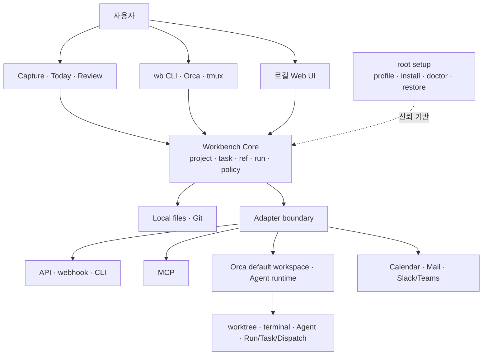

# Setup 통합 제품 기획서

> 상태: **방향 확정·MVP 검증 전 v1.0**
> 기준일: 2026-08-10
> 근거: [raw/](raw/) · [통합 판단](raw/synthesis-and-decisions.md)
> 이전 계획: [archive/2026-08-10-plan-v1/](archive/2026-08-10-plan-v1/)
> Dashboard 상세: [DASHBOARD-SPEC.md](DASHBOARD-SPEC.md)
> 목표 구조·전달: [ARCHITECTURE.md](ARCHITECTURE.md) · [IMPLEMENTATION-ROADMAP.md](IMPLEMENTATION-ROADMAP.md)

## 1. 한 문장 제품 정의

**Setup은 내 데이터와 도구의 소유권을 지키면서, 어느 장비에서든 개인 업무와 개발 맥락을 안전하게
준비하고 이어가고 복구하는 local-first 개인 운영 환경이다.**

개발환경 재현은 신뢰 기반이고 최종 목적은 아니다. 제품의 핵심은 문서·계획·코드·반복 업무·외부
서비스를 한 데이터베이스로 복제하는 것이 아니라, 각 원본의 소유권을 보존하며 다음 행동과 실행 위치,
결과와 복구 경로를 연결하는 것이다. MCP는 API, webhook, CLI, 파일, Git과 동등한 adapter 방식 중
하나다. Agent 관리에는 Orca를 우선 선택 backend로 연결하고, 자체 orchestrator는 수요가 증명되기 전에는
만들지 않는다.

## 2. 목표 사용자와 핵심 문제

### 목표 사용자

첫 사용자는 여러 저장소와 장비에서 개발·인프라 업무를 하면서 개인 일정, 문서, 읽을거리와 반복 업무도
직접 통제하려는 한 명의 숙련 사용자다. 개인 계정과 업무 계정은 분리하되, 허용된 metadata와 다음 행동은
같은 화면에서 보고 싶어 한다. 팀용 협업 제품은 후속 가능성일 뿐 현재 목표가 아니다.

### 해결할 문제

1. **맥락 단절:** 요청, 문서, repository, terminal, Agent와 결과가 흩어져 다음 행동을 재구성하는 데 시간이 든다.
2. **환경·복구 불확실성:** 새 장비, update, 손상 뒤 어떤 조합이 검증됐고 어떻게 복구할지 분명하지 않다.
3. **소유권·권한 혼선:** 개인/업무 계정과 여러 도구가 같은 대상을 보여주거나 쓸 때 원본과 mutation owner가 흐려진다.
4. **자동화의 불투명성:** 부분 성공, 재시도, 자격 증명 만료와 외부 side effect가 한 개의 `failed` 상태로 뭉개진다.
5. **연동 종속성:** 서비스별 설정과 인증이 분산되고, 하나의 protocol 또는 vendor에 맞춘 공통화가 오히려 복구성을 해칠 수 있다.

핵심 Job은 “모든 정보를 한곳에 저장”이 아니라 **해야 할 일을 놓치지 않고, 올바른 맥락과 권한에서
실행하며, 중단·실패 뒤 원래 상태로 돌아가거나 이어가는 것**이다.

## 3. 제품 원칙과 비목표

### 제품 원칙

- **Local-first:** 사용자 작성 데이터와 핵심 index는 로컬에서 읽고 내보낼 수 있어야 한다.
- **도메인별 원본 하나:** 외부 원문은 외부 서비스가, code는 Git이 소유한다. Setup은 reference와 projection을 가진다.
- **개인/업무 경계:** 함께 보는 것은 허용된 metadata이고 자격 증명, 원문, 외부 쓰기 권한은 context별로 분리한다.
- **관찰과 소유 분리:** 발견한 terminal·worktree·Agent를 관리 대상으로 추정하지 않는다.
- **명시적 권한:** 위험도, 대상, effective permission을 실행 전에 보이고 write/delete는 재검증과 승인을 요구한다.
- **복구 가능성이 기능의 일부:** preview, checkpoint, backup, disable, export, rollback과 수동 경로를 함께 설계한다.
- **점진적 자동화:** 반복 근거가 있는 typed workflow만 수동 실행 → dry-run → 승인 실행 → schedule 순으로 승격한다.
- **작은 core, 교체 가능한 edge:** file, Git, API, webhook, CLI, MCP와 Agent backend를 adapter로 격리한다.
- **사실과 신뢰도 표시:** stale, partial, observed, retryable, blocked를 숨기지 않고 근거 시각과 함께 보여준다.
- **지원 범위는 증명 수준대로:** build, fixture, 실제 장비 smoke를 구분한다.

### 비목표

- 범용 notes/문서/프로젝트 관리 제품을 새로 만드는 것
- 모든 외부 원문을 중앙 데이터베이스로 복제하는 것
- 팀·조직용 multi-user control plane과 상시 cloud service
- 임의 shell을 실행하는 범용 자연어 자동화 엔진
- 모든 MCP traffic을 중계하는 proxy 또는 MCP 중심 아키텍처
- Secret 값을 모으는 중앙 vault
- 초기부터 자체 scheduler, message bus, Agent DAG runtime을 구현하는 것
- 모든 OS, desktop, mobile에 동등한 native client를 동시에 제공하는 것

## 4. 대표 사용 시나리오

### 아침: 오늘과 중단 지점 확인

Today에서 due task, calendar busy block, 실패한 run, 중단한 terminal·Agent를 본다. 외부 sync가 실패하면
cached 시각을 표시하고 로컬 task와 project resume은 계속 동작한다.

### 요청 수집에서 실행까지

URL, 파일, Slack/GitHub 항목 또는 한 줄 메모를 로컬 Inbox에 저장한다. 원문 reference와 personal/work
provenance를 보존하고 project와 next action을 붙인다. 실행 시 repository, account, 권한과 완료 조건을
다시 확인한다.

### 개발과 Agent 작업

project에서 관련 task·문서·Git 상태·worktree를 모아 기본 terminal workspace인 Orca로 연다. 사람의
shell/editor 작업은 Orca worktree별 tmux partition으로 나누고 Agent는 Orca 아래에서 직접 실행한다.
Workbench가 Windows Terminal이나 iTerm2를 별도 surface/backend로 선택·실행하지 않으며, WSL과 macOS 모두
Orca 하나를 사용자 workspace로 사용한다. cmux는 신규 제품 경로에서 제외하고 기존 호환 구현만 이력으로
보존한다. Orca가 runtime을 소유하고 Setup은 opaque reference와 관찰 시각, 결과 pointer만 보존한다. diff,
test, 미결 항목을 review packet으로 만들며 commit, push, merge는 별도 승인 작업이다.

### 검토와 자동화 승격

완료, 대기, 차단, 미분류 Inbox와 실패 run을 검토한다. 세 번 이상 반복된 흐름만 typed recipe 후보로
만들고 입력, 위험, timeout, retry, 중지와 rollback을 먼저 정의한다.

### 장비 복구

profile과 prerequisite를 확인하고 setup, doctor, restore를 수행한다. Workbench 또는 외부 서비스가 없어도
terminal·Git·로컬 Markdown의 최소 경로로 프로젝트와 작업을 찾을 수 있어야 한다.

## 5. 정보 구조와 핵심 흐름

### 사용자 정보 구조

| 영역 | 답하는 질문 | 주요 내용 |
|---|---|---|
| Today | 지금 무엇을 해야 하고 무엇이 깨졌나 | task, busy block, resume, failed/stale run |
| Inbox | 새 입력을 어떻게 처리할까 | provenance, 원문 ref, 분류 상태 |
| Projects | 결과와 다음 행동, 실행 위치는 어디인가 | task, note/ref, repo/worktree/session/Agent |
| Areas | 계속 책임지는 개인·업무 영역은 무엇인가 | context, account, policy, review |
| Library | 근거와 결정으로 어떻게 돌아가나 | local note, decision, external ref |
| Runs & Agents | 무엇을 실행했고 어디까지 됐나 | recipe, attempt, checkpoint, artifact, outcome, provider Agent ref |
| Integrations | 무엇과 어떤 권한으로 연결됐나 | adapter, capability, scope, cursor, health |
| System & Recovery | 설치와 데이터가 복구 가능한가 | profile, doctor, snapshot, backup, restore |

### 공통 사용자 흐름

```text
수집 → 정리 → 계획 → 실행 → 검토 → 검증된 반복만 자동화
  ↑       provenance · context · policy · journal · recovery       │
  └──────────────── 결과와 다음 행동의 feedback ─────────────────┘
```

모든 입력과 실행은 `received → staged → applied → reviewed`를 기본으로 하고, 예외는
`blocked(auth/policy/conflict)`, `retryable(network/rate-limit)`, `partial(남은 자산+복구 지침)`로
구분한다.

### 최소 개념 모델

```text
Context(personal|work, policy, account/secret refs)
  ├─ Area ─ Project ─ Task
  │              ├─ Note / Decision / ExternalRef
  │              ├─ WorkLocation(repo/worktree/session/agent ref)
  │              └─ Run(attempt/checkpoint/artifact/outcome)
  └─ InboxItem(SourceEvent + provenance + classification)

Adapter(capabilities, auth_ref, cursor, health)
Recipe(typed_input, risk, approval, retry/recovery policy)
```

## 6. 시스템 개념 구조



책임 경계는 다음과 같다.

| 구성 | 소유 책임 | 소유하지 않는 것 |
|---|---|---|
| root setup | profile, provisioning, 검증 조합, doctor, restore | child 기능과 사용자 원문 |
| Workbench Core | 장기 project/task/ref/run index, policy, local projection | 외부 원문과 provider runtime lifecycle |
| `wb` CLI/Dashboard | 같은 Core를 통한 capture, review, search, jump, 제한된 typed action | source of truth와 임의 shell |
| tmux/LazyVim/binbox | Orca worktree별 human work partition과 독립 실행·복구 경로 | 중앙 registry와 Orca Agent lifecycle |
| Adapter | capability, ID mapping, health, cursor, disable | provider 내부 상태 추측 |
| Orca | 기본 terminal workspace와 worktree·terminal·Agent·orchestration runtime | 장기 개인 업무 index |
| OS shell | Orca 장애 시 운영자가 실행하는 수동 `wb`/Markdown/Git break-glass | 제품 workspace와 자동 terminal launch |
| Windows Terminal/iTerm2/cmux | 신규 제품 역할 없음; 기존 호환 구현은 deprecation 전까지 보존 | 목표 workspace와 신규 기능 |

일반 설치는 **`workbench` profile을 기본값**으로 삼아 Workbench와 prerequisite를 필수로 검증한다.
`terminal` profile은 tmux·LazyVim·binbox만으로 복구하거나 최소 설치할 때 명시적으로 선택하는 독립
fallback이다. 이 구분은 제품 중요도의 차이가 아니라 설치 성공 계약과 장애 격리를 위한 것이다.

## 7. 선정된 핵심 기능

### MVP 핵심

1. **신뢰 기반:** WSL primary Tier-1과 macOS 병행 검증, profile preflight, 검증된 lock manifest,
   fresh setup/doctor, backup restore.
2. **Context 경계:** personal/work/account 정책, source와 destination 표시, 교차 write fail-closed.
3. **Local Inbox:** file/stdin/manual capture, provenance, 수신 시각, 원문 reference, 중복 후보 표시.
4. **Project·Task·Resume:** next action, 완료 조건, related ref, repo/worktree/session 위치와 text search.
5. **Today·Review:** due/next, 미분류, stale integration, 실패·partial run, 중단 위치를 한 projection에서 확인.
6. **Typed action과 run journal:** preview, risk label, explicit approval, checkpoint, 결과 pointer, 복구 지침.
7. **Adapter health 계약:** file/Git을 첫 구현으로 하고 capability, scope, cursor, health, disable/export를 통일.
8. **Orca E0/E1 실험:** 사용 관찰 후 read-only health·summary·open/jump adapter. controlled launch는 MVP gate 밖이다.

Dashboard는 기존 operations console을 유지·재사용해 장기적으로 **Today / Inbox / Projects / Runs & Agents /
Integrations / System & Recovery**로 발전시킨다. MVP에서는 `wb` CLI를 capture/action의 terminal-first 경로로,
Dashboard를 Today/review 권장 UI로 두며 둘 다 같은 Workbench Core query/action을 사용한다. 상세 IA와
호환·안전 계약은 [Dashboard 명세](DASHBOARD-SPEC.md)를 따른다. Orca E0/E1의 read-only 제한은 사용자가
Orca를 기본 workspace로 쓰는 행위가 아니라 **Workbench가 Orca runtime에 행사하는 adapter 권한**에 적용한다.

### 다음 기능

- recurring task와 weekly review
- GitHub read-only metadata intake를 첫 외부 connector로 추가
- Slack read-only intake를 두 번째 connector로 추가하되 GitHub 계약을 재사용할 수 있을 때만 진행
- Orca의 정책이 보이는 controlled launch와 result pointer 회수
- 두 번째 platform smoke, release/rollback 계약

## 8. 제외·보류한 기능과 이유

| 기능 | 분류 | 이유/재검토 조건 |
|---|---|---|
| Orca stop/remove 자동화 | 보류 | stable ownership·identity와 재검증 없이는 파괴 위험; E2 이후 검토 |
| 자체 multi-agent scheduler/DAG | 장기 실험 | Orca가 이미 큰 runtime surface를 소유; 두 backend 간 공통 수요 gate 필요 |
| MCP catalog/config mutation | 실험 | client별 scope·merge·auth가 다름; 먼저 read-only inventory와 1 server/2 client 가역 실험 |
| mail/calendar/Docs 양방향 sync | 보류 | 충돌·권한·부분 성공 반경이 큼; read-only 사용 가치부터 확인 |
| 자연어 arbitrary automation | 제외 | 대상·재시도·복구 계약이 불명확하고 credential blast radius가 큼 |
| cloud sync·remote runner | 보류 | threat model, 암호화, 충돌·복구 계약이 선행돼야 함 |
| native desktop/mobile app | 보류 | CLI+local web의 핵심 루프 사용 근거가 먼저; mobile은 capture/share target부터 검토 |
| generic plugin/proxy framework | 제외 | 성급한 추상화와 단일 실패점; adapter 두 개 이상에서 같은 계약이 반복될 때 재검토 |
| team/multi-user 기능 | 제외 | 현재 개인용 문제와 권한 모델을 흐림 |

binbox 명령과 독립 terminal 경로는 정리·삭제 대상이 아니다. 기능 중복은 제거 개수가 아니라 owner와
fallback이 명확한지로 판단한다.

## 9. 보안·데이터 원칙

- 사용자 작성 task, note, decision, policy와 run metadata는 portable local format으로 export한다.
- 외부 원문은 기본 복제하지 않고 immutable ID, URL, 제한된 cached metadata와 관찰 시각을 저장한다.
- Secret 값은 공통 state, log, prompt, audit에 저장하지 않는다. OS/provider vault reference와 availability만 둔다.
- adapter는 최소 scope, account/context 표시, revoke·disconnect·cached data 보존/삭제 선택을 제공한다.
- 모든 managed write는 canonical target을 직전에 재검증하고 preview와 승인을 거친다.
- read/idempotent 작업만 제한적으로 자동 재시도한다. write/delete timeout은 provider 상태를 다시 확인한다.
- journal은 입력 전문보다 action ID, 대상, 정책, 시각, outcome, artifact pointer를 남기며 사용자가 export·삭제할 수 있다.
- backup은 쓰기 전 생성하고 schema validation과 실제 restore drill로 검증한다.
- 사용자가 작성하는 task·note·decision은 **Markdown을 canonical format**으로 삼고, stable ID와 최소
  frontmatter를 사용한다. 중요한 approval, plan hash, mutation outcome, checkpoint/recovery instruction도
  append-oriented Markdown 또는 portable journal에 먼저 확정한다. SQLite는 검색·dedupe·cursor·Today 같은
  재구축 가능한 projection/cache다.
- state는 [목표 아키텍처의 분류](ARCHITECTURE.md#6-canonical-data와-operational-state-분류)에 따라
  C1–C3(canonical/portable), O1(authoritative local operation), O2(provider projection), O3(derived cache),
  Secret으로 분류한다. pending mutation·idempotency/fencing·미조정 outcome 같은 O1을 SQLite에만 두거나
  `rebuildable`이라고 부르지 않는다.
- 여러 장비의 Markdown·설정 history는 private GitHub repository를 우선 사용한다. runtime state,
  attachment와 전체 snapshot은 Secret을 제외한 암호화 archive로 OneDrive에 보관한다. 같은 working tree를
  Git과 OneDrive가 동시에 동기화하지 않으며, OneDrive 사본도 정기 restore drill을 통과해야 한다.
- 외부 서비스와 Orca가 없어도 local data read, project path, Git·terminal 복구 경로는 유지한다.
- worktree는 보안 sandbox가 아니다. Agent launch에는 `safe`, `trusted-local`, `infrastructure` 같은 정책 profile과
  effective permission을 보여준다.

## 10. MVP 범위와 성공 지표

### 30일 MVP의 닫힌 루프

`한 입력을 10초 안에 로컬 capture → project/next action 연결 → 안전한 실행 위치로 resume → 결과와
partial failure 검토 → backup에서 복구`를 WSL primary Tier-1에서 반복 가능하게 만든다. macOS는 같은
30일 흐름을 병행 검증하되 각 platform의 통과 여부를 독립적으로 기록한다.

MVP는 모든 UI를 완성하지 않는다. CLI를 capture/action 기본 경로로, 로컬 Web UI를 Today/review 보조로
사용한다. 외부 연동은 file/Git으로 제한하고 Orca는 read-only 실험만 허용한다.

### 성공 지표

| 목표 | 30일 판정 기준 |
|---|---|
| 신뢰성 | WSL fresh setup+doctor 2회, update 2회, synthetic 손상 restore 1회 성공 |
| macOS 병행 | 같은 smoke를 2회 통과하면 함께 Tier-1로 승격하고, 미통과 시 experimental로 명시 |
| 실제 가치 | 2주 동안 실제 Inbox 항목 20개 이상, end-to-end loop 3개 이상 완료 |
| 속도 | capture 중간값 10초 이하, project 중단 지점 복귀 중간값 60초 이하 또는 baseline 대비 30% 개선 |
| 맥락 | task의 원문 provenance 보존 100%, 잘못된 personal/work 교차 write 0건 |
| 복구 | managed write의 preview/approval/journal 100%, partial failure마다 생존 자산과 다음 행동 표시 |
| 통제 | plaintext Secret 저장 0건, 모든 adapter disable/export 경로 문서화 |
| Orca E1 | 사용 gate 충족 시 잘못된 worktree jump 0, Orca 부재 시 기존 경로 유지 100% |

local usage 기록은 opt-in이고 category, 상태, 시각과 소요 시간만 저장한다. command, prompt, path, Secret
전문은 수집하지 않는다.

## 11. 로드맵

아래 30/90일 구분은 제품 horizon이며 구현 완료 순서는
[staged roadmap](IMPLEMENTATION-ROADMAP.md)의 S0–S9 dependency와 acceptance가 소유한다. `Runs`와
`Recovery`라는 stage 문구는 각각 Dashboard의 **Runs & Agents**, **System & Recovery** 영역을 줄여 쓴
표현이다.

| 제품 horizon | delivery stage 연결 |
|---|---|
| 0~30일 | S1 trust foundation → S2 canonical core → S3 client parity; S4A Orca E0와 S7 history/snapshot branch는 dependency 충족 시 병행 |
| 31~90일 | S4B Orca E1 promotion, S5 GitHub read → S6 Slack read, S7 clean restore; acceptance를 통과한 경우에만 S8 |
| 장기 | S8 controlled launch의 잔여 검증과 S9 limited write decision gate 이후 evidence 기반 확장 |

모든 stage에서 Dashboard는 후속 polish가 아니라 CLI와 함께 deliverable이다. 같은 fixture/action에서 plan hash,
state transition, outcome/error code와 receipt schema mismatch가 0이어야 client parity를 충족한다.

### 0~30일 — 신뢰 기반과 한 개의 개인 운영 루프

- WSL을 primary Tier-1로 확정하고 macOS를 같은 30일 smoke track에서 병행 검증한다.
- 일반 설치는 `workbench`, 복구·최소 설치는 명시적 `terminal` profile이 되도록 selector와 exit
  contract를 맞춘다.
- lock을 최신 HEAD 목록이 아니라 검증 날짜·run·rollback이 붙은 manifest로 정의한다.
- fresh setup/update/doctor/restore smoke를 수행한다.
- Markdown+최소 frontmatter를 canonical authoring format으로, SQLite를 재구축 가능한 projection으로 두고
  Context, InboxItem, Project, Task, ExternalRef, WorkLocation, Run의 최소 schema를 고정한다.
- file/stdin capture, Today/Next review, project resume, typed action journal을 세로로 연결한다.
- 2주 또는 Agent session 20개의 Orca/direct 경로 E0 관찰을 한다.
- E0 gate를 통과하면 Orca read-only status·summary·open/jump spike를 수행한다.

### 31~90일 — 반복 사용과 한정 연동

- 30일 기록에서 가장 큰 마찰 한 개만 개선한다.
- recurring task와 weekly review를 추가한다.
- GitHub read-only metadata adapter를 먼저 검증하고, 같은 provenance·cursor·health 계약을 재사용할 수
  있을 때 Slack read-only adapter를 이어서 검증한다.
- adapter의 stale, cursor/reconcile, disconnect/export를 검증한다.
- Orca E1 성공 시 safe profile controlled launch와 result pointer 회수 E2를 진행한다.
- macOS가 30일 gate를 통과하면 두 번째 Tier-1로 승격하고, 그렇지 않으면 experimental로 유지한다.
  이후 release/rollback 및 문서 owner를 정리한다.
- 사용 중인 MCP 한 개가 있을 때만 read-only inventory와 가역적인 1 server/2 client 실험을 한다.

### 장기 — 증거 기반 확장

- 외부 read adapter를 제한된 write로 승격하고 calendar, mail, Slack/Teams, Docs를 하나씩 검증한다.
- encrypted cross-device sync, mobile quick capture/share target, remote runner를 별도 threat model 뒤 검토한다.
- Orca orchestration pass-through는 E2 뒤 dependency가 있는 실제 목표 10개로 검증한다.
- Orca와 non-Orca backend를 함께 쓰는 목표가 월 10회 이상이고 read-only projection으로 해결되지 않는
  audit/queue 불편이 월 3회 이상일 때만 provider-neutral control/registry를 재검토한다.
- 자체 scheduler/message bus/DAG는 두 provider의 stable attempt ID, crash/retry fixture, 30일 shadow mode 상태
  불일치 1% 미만을 모두 충족할 때만 설계한다.

## 12. 리스크, 검증 실험과 중단 기준

| 위험 | 검증 실험 | 중단·피벗 기준 |
|---|---|---|
| 통합 범위가 다시 팽창 | 2주 실제 closed-loop 사용 | 표본 20개 전에는 두 번째 외부 adapter나 새 UI를 시작하지 않음 |
| 환경 기반이 불안정 | fresh/update/restore 반복 smoke | 수동 삭제·force Git이 복구에 필요하면 기능 추가 동결 |
| Dashboard가 기본 경로가 아님 | CLI/tmux와 4주 복귀 비교 | 자발적 사용 50% 미만 또는 fallback 20% 초과면 ops 보조 UI로 고정 |
| 외부 projection이 stale/중복 | event ID+cursor reconcile fixture | 원문 유실·자동 덮어쓰기 발생 시 write 기능 중단 |
| 자동화가 위험을 키움 | dry-run, 중복 실행, timeout, partial fixture | arbitrary target 또는 비멱등 write를 안전하게 재검증 못하면 recipe 승격 금지 |
| Orca 종속·상태 불일치 | E0→E1→E2 단계 gate | transcript scraping 필요, 30일 내 계약 파괴 2회, identity 모호 1% 이상이면 adapter를 jump link로 축소 |
| Agent 권한 과다 | effective policy와 10개 비파괴 task | bypass override 검증 실패, credential 노출, 중복 launch 한 건이면 E2 중단 |
| MCP 공통화가 설정을 훼손 | 임시 config에서 dry-run→diff→apply→health→rollback | byte-identical rollback 또는 Secret reference가 불가능하면 generator 폐기 |
| GitHub/OneDrive 충돌·유출 | Git working tree와 encrypted snapshot을 분리해 restore 검증 | 동일 경로 이중 sync, plaintext Secret 또는 반복 충돌이 생기면 해당 provider 자동화를 중단 |

## 13. 확정 결정과 남은 검증

### 사용자와 확정한 결정

1. WSL을 primary Tier-1로 삼고 macOS를 같은 30일 track에서 병행 검증한다.
2. 일반 설치의 기본값은 `workbench`, 복구·최소 설치는 명시적 `terminal` profile로 한다.
3. LLM wiki처럼 Markdown을 사용자 작성 정보의 canonical format으로 우선한다. SQLite는 파생 index다.
4. 외부 read connector는 GitHub를 먼저, Slack을 다음으로 진행한다.
5. private GitHub는 Markdown·설정 history, OneDrive는 암호화된 backup snapshot에 사용한다.
6. Agent 결과는 metadata·artifact pointer를 기본으로 하고 transcript는 작업별 opt-in으로만 보존한다.
7. Agent permission은 `safe`를 기본으로 하며 `trusted-local`, `infrastructure`는 대상·credential·승인을
   명시한 별도 profile로 둔다.
8. lock manifest는 실제 smoke 기준 90일이 지나면 검증 만료로 표시하고 재검증 전 자동 승격하지 않는다.
9. Dashboard는 Today/review의 권장 UI로 두되 CLI·terminal을 항상 독립 복구 경로로 유지한다.
10. Dashboard는 별도 state owner가 아니며 `wb` CLI와 Workbench Core를 공유한다. 목표 navigation은 Today,
    Inbox, Projects, Runs & Agents, Integrations, System & Recovery다.
11. Orca는 WSL과 macOS의 유일한 제품 workspace surface이며 Agents는 Orca 아래에서 직접 실행한다.
    Workbench는 Windows Terminal/iTerm2/cmux integration을 신규 목표에서 제외하고, tmux만 Orca worktree별
    human work partition으로 유지한다. Orca 장애 시 `wb`·Markdown·Git 직접 접근은 자동 terminal
    integration이 아닌 문서화된 수동 복구 경로다.

### 관찰 후 확정할 항목

1. 매일 반복되는 대표 세 흐름과 첫 30일 실제 입력 20개의 구성
2. Markdown frontmatter의 최소 필드와 파일 배치·rename 규칙
3. GitHub와 Slack account별 personal/work scope 및 retention
4. 첫 제한적 write integration의 action, idempotency와 rollback 계약
5. Orca E0 사용률과 read-only E1 승격 여부
6. macOS가 WSL과 함께 Tier-1 gate를 통과하는지

다음 실행 순서는 staged DAG를 따른다. **S1 WSL/macOS profile smoke → S2 Markdown/schema/export → S3 30일
대표 loop → S5 GitHub read → S6 Slack read**가 critical path다. S4A Orca E0는 S1 뒤 S2/S3과 병행하고,
S4B E1은 S3+E0 promotion 뒤에만 진행한다. S7 history/snapshot branch와 clean restore를 독립 gate로 닫은 뒤
S8 controlled launch와 S9 제한 write를 검토한다. 이 dependency를 벗어나는 기능은 실제 장애나 반복 사용
증거와 owner/rollback이 있는 decision gate에서만 예외로 받아들인다.

## 14. 근거와 결정 이력

- 제품 전략: [raw/product-strategy-research.md](raw/product-strategy-research.md)
- 사용자 시나리오·기능 후보: [raw/user-scenarios-and-features.md](raw/user-scenarios-and-features.md)
- 기술·연동·보안: [raw/technical-integration-security.md](raw/technical-integration-security.md)
- 평가·우선순위: [raw/prioritization-and-roadmap.md](raw/prioritization-and-roadmap.md)
- Agent 관리·Orca 전략: [raw/agent-management-orchestration.md](raw/agent-management-orchestration.md)
- 워커 충돌과 최종 선택: [raw/synthesis-and-decisions.md](raw/synthesis-and-decisions.md)
- 현재 저장소 기준선과 미결 질문: [raw/repository-baseline.md](raw/repository-baseline.md),
  [raw/backlog-and-open-questions.md](raw/backlog-and-open-questions.md)

완료된 이전 계획은 archive에 보존한다. 구현 세부 계약은 root와 각 child 저장소 문서를 우선하며, 이
문서는 제품 방향, 범위, gate와 성공 기준을 소유한다.
