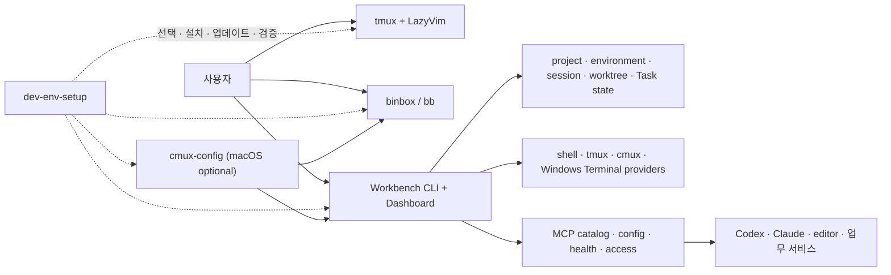

# Setup 제품 기획서

> 상태: **공동 검토용 v0.2**
> 기준일: 2026-08-10
> 근거: [raw/](raw/)
> 이전 계획: [archive/2026-08-10-plan-v1/](archive/2026-08-10-plan-v1/)

이 문서는 이전 Phase를 연장하는 계획이 아니다. 현재 구현을 다시 관찰한 뒤 제품의 중심, 지원 범위,
우선순위와 성공 기준을 사용자와 함께 새로 결정하기 위한 초안이다.

## 1. 제안하는 제품 정의

**Setup은 여러 장비에서 개인 업무와 개발 작업을 안전하게 시작하고, 이어가고, 확장하게 해주는
나만의 terminal-first 업무·개발 도구 플랫폼이다.**

개발환경 재현은 기반이고 최종 목적은 아니다. 그 위에서 프로젝트와 작업 맥락을 이어가고,
Codex·Claude·에디터·업무 서비스를 일관된 정책으로 연결하는 개인용 도구를 만든다. 범용 IDE나 팀
control plane보다 좁고 개인 워크플로에 맞게 진화한다. tmux·LazyVim·binbox는 실제 작업 도구,
root setup은 재현성과 호환성, Workbench는 구조화된 상태·복귀·통합 관리를 담당한다.

### 검토가 필요한 대안

| 선택 | 장점 | 비용 | 초안 의견 |
|---|---|---|---|
| A. 설치·dotfiles 관리 도구 | 범위가 작고 이해가 쉬움 | 이미 구현된 상태·Dashboard 기능을 주변 기능으로 만듦 | 현재 구현보다 너무 좁음 |
| B. 개인 업무·개발 도구 플랫폼 | 환경 재현부터 작업·도구 통합까지 하나의 사용자 여정으로 설명 | 개인 워크플로에 맞춘 명확한 제품 경계가 필요 | **사용자 방향 확인** |
| C. Workbench 중심 IDE | 단일 제품 메시지가 강함 | terminal 독립성과 기존 도구의 장점을 약화 | 근거 부족 |

### 장기 비전 — MCP 관리

MCP는 이 제품이 관리할 수 있는 자연스러운 통합 영역이다. 목표는 모든 요청을 가로채는 거대한 MCP
proxy가 아니라, 개인 환경에서 사용하는 MCP server와 client 연결을 안전하고 재현 가능하게 관리하는
control plane이다.

| 관리 대상 | 제품이 제공할 수 있는 가치 |
|---|---|
| Catalog | 사용 중인 MCP server, 제공 tool/resource, 지원 client 목록 |
| Lifecycle | 설치, update, enable/disable, version compatibility |
| Configuration | Codex·Claude·에디터별 설정을 하나의 선언에서 안전하게 파생 |
| Health | executable, transport, handshake, capability와 최근 실패 진단 |
| Access | Secret 값 대신 reference, 환경별 scope, 최소 권한과 명시적 승인 |
| Audit | 어떤 client가 어떤 server를 사용하도록 설정됐는지 metadata 기록 |

MCP tool 호출 내용 전체를 저장하거나, 모든 Secret을 중앙화하거나, 임의 server를 검증 없이 자동
설치하는 것은 기본 범위가 아니다. root setup은 설치·배포, Workbench는 registry·health·정책·상태,
각 client는 실제 MCP 연결과 사용자 승인 UI를 담당하는 구성이 유력하다.

## 2. 대상 사용자

현재 primary user는 여러 OS와 장비에서 인프라·개발 작업을 수행하는 한 명의 숙련 사용자다.

주요 상황:

- 새 장비 또는 재설치 후 환경을 복구한다.
- 여러 repository와 worktree 사이를 자주 이동한다.
- tmux에서 장시간 작업과 Agent를 실행하고 나중에 복귀한다.
- AWS, Kubernetes, Terraform 작업을 반복하지만 위험한 동작은 명시적으로 확인한다.
- macOS, Linux, WSL 사이에서 가능한 한 같은 mental model을 원한다.
- 자동화가 실패했을 때 원인과 수동 복구 경로를 확인하고 싶다.

팀 협업, 원격 multi-user control, 중앙 cloud state는 현재 대상이 아니다.

## 3. 해결할 핵심 문제

### P1. 장비 재현성

무엇을 설치하고 어떤 순서로 연결했는지, 현재 조합이 검증된 조합인지 한 번에 알기 어렵다.

### P2. 작업 연속성

프로젝트, tmux session, worktree, Agent와 최근 실패가 여러 도구에 흩어져 있어 다음 행동과 복귀
지점을 찾는 비용이 든다.

### P3. 책임 중복

`bb`, tmux/LazyVim, Workbench가 일부 같은 대상을 보여준다. 중복 자체보다 어느 경로가 owner이고
어느 경로가 fallback인지 불명확할 때 유지보수와 복구가 어려워진다.

### P4. 지원 범위의 증거 부족

cross-build와 fixture test는 강하지만 실제 macOS/cmux, Windows/WSL, 별도 Linux 장비의 대표 흐름
증거가 부족하다.

### P5. 계획과 사실의 drift

완료 로그, 현재 계약, 미래 아이디어가 같은 문서에 누적되면서 “지금 무엇이 사실이고 다음 결정이
무엇인지” 찾기 어려워졌다.

### P6. AI·업무 도구 통합 설정의 분산

Codex, Claude, 에디터와 업무 서비스가 각자 MCP 설정, credential 경계, 설치 방식과 health 진단을
가지면 장비마다 같은 통합을 재현하고 문제 원인을 찾기 어렵다.

## 4. 사용자 가치 제안

1. **한 번에 준비한다** — 새 장비에서 저장소, 링크, 설정의 상태를 예측 가능하게 만든다.
2. **안전하게 업데이트한다** — 로컬 변경을 덮지 않고 fast-forward와 검증된 계약으로 업데이트한다.
3. **빠르게 복귀한다** — 프로젝트와 실제 작업 surface를 구조화해 다시 들어갈 위치를 보여준다.
4. **실패를 숨기지 않는다** — provider 출력, exit code, partial/optional 상태와 복구 지침을 보존한다.
5. **기존 도구를 존중한다** — tmux·LazyVim·binbox를 Workbench 장애와 무관한 독립 작업 경로로 유지한다.
6. **위험한 작업을 제한한다** — typed action, ownership 재검증, 명시적 확인을 기본값으로 둔다.
7. **도구 연결을 재현한다** — MCP server와 client 설정·health·권한을 장비마다 같은 원칙으로 관리한다.

## 5. 제품 원칙 초안

- Terminal first, UI assisted.
- Source of truth는 도메인별로 하나만 둔다.
- 관찰과 소유를 구분한다.
- 자동 fallback은 primary 실패를 숨기지 않는다.
- 로컬 변경과 외부 생성 자원을 추측으로 삭제하지 않는다.
- platform 지원은 실제 장비에서 증명한 수준으로 표현한다.
- Secret과 환경 값은 metadata와 plaintext 경계를 분리한다.
- 새 추상화는 반복되는 실제 사용 사례가 확인된 뒤 만든다.
- MCP는 catalog·configuration·health·access를 관리하되 불투명한 범용 proxy가 되지 않는다.
- 문서는 현재 사실, 제품 결정, 완료 이력을 분리한다.

## 6. 제품 구성 초안

| 구성요소 | 제품 책임 | 비책임 |
|---|---|---|
| root setup | platform 선택, provisioning, update, compatibility snapshot, aggregate health | child 기능 구현 |
| binbox | 빠른 terminal operator workflow | 중앙 상태 registry |
| nvim/tmux | 편집과 terminal workspace, 독립 실행 경로 | 전체 장비 provisioning |
| Workbench Core | project·environment·session·worktree·Task의 구조화 state와 안전한 action | 임의 shell과 모든 provider 대체 |
| Dashboard | 로컬 상태 이해, 복귀, 제한된 typed operation | 외부 공개 UI와 Secret plaintext 관리 |
| cmux-config | macOS 선택 client/backend | cross-platform 필수 runtime |
| MCP Management | server catalog, client config 파생, health, access policy | 모든 tool 호출 중계와 Secret 중앙화 |

### 가장 큰 미결정

Workbench는 제품 개념상 optional recovery-independent core로 설명되어 왔지만 setup profile에서는
required다. 다음 중 하나를 선택해야 한다.

- **필수:** 상태 core까지 설치돼야 setup 성공으로 본다.
- **권장:** 설치를 시도하되 toolchain 부족은 partial/optional로 보고 terminal 환경은 성공 처리한다.
- **profile별:** 기본 개발 profile에서는 필수, minimal terminal profile에서는 제외한다.

초안은 **profile별 정책**을 선호하지만 사용자 합의가 필요하다.

## 7. 핵심 사용자 여정

### Journey A — 새 장비 준비

clone → platform 선택 확인 → toolchain prerequisite 확인 → bootstrap → doctor → 검증 snapshot 기록.

### Journey B — 평소 업데이트

dirty state 확인 → child fast-forward update → plugin/binary sync → contract/doctor → 실패 repo만 복구.

### Journey C — 프로젝트 시작과 복귀

project 선택 → 현재 session/worktree/Task 확인 → 기존 surface 복귀 또는 새 backend open → 결과 기록.

### Journey D — Agent 작업

project/worktree 선택 → Codex/Claude 시작 → stable ownership 저장 → 상태 관찰 → 안전한 jump/stop.

### Journey E — 인프라 작업

`bb` 또는 allowlisted workflow 선택 → 환경/Secret 경계 확인 → plan/test 실행 → 결과와 실패 진단 확인.

### Journey F — 장애 복구

doctor/overview 확인 → core와 optional provider 구분 → backend diagnostics 확인 → 수동 독립 경로 또는
backup으로 복구.

### Journey G — MCP 도구 연결

필요한 capability 선택 → 검증된 server 확인 → 설치·Secret reference 연결 → 대상 client 설정 생성 →
handshake/health 확인 → 필요 시 client별 disable 또는 rollback.

## 8. 성공 기준 초안

정량 telemetry를 새로 수집하기 전에는 대표 여정의 완주와 복구 가능성을 기준으로 한다.

| 영역 | 성공 기준 |
|---|---|
| 재현성 | 지원 platform에서 빈 환경부터 doctor healthy까지 문서화된 절차로 완료 |
| 업데이트 | 사용자 변경을 보존하고 실패 repository를 명확히 식별 |
| 복귀 | 등록 project에서 실제 session/worktree/Agent 위치로 안전하게 이동 |
| 실패 투명성 | backend command, exit code, stdout/stderr 또는 명확한 unavailable 이유 제공 |
| 독립성 | Workbench/Dashboard가 없어도 합의한 terminal 기본 흐름 동작 |
| 안전 | 외부 worktree, observed process, foreign session, Secret plaintext를 임의 변경·노출하지 않음 |
| 통합 | 같은 MCP 선언에서 대상 client별 설정을 생성하고 Secret 평문 없이 health를 확인 |
| 문서 | 현행 진입점에서 5분 안에 현재 상태, 다음 결정, 검증 범위를 찾을 수 있음 |

향후 실제 사용 데이터가 필요하다면 command 내용이 아니라 기능 category, 성공/실패, primary/fallback,
timestamp만 로컬에 기록하는 방식을 검토한다.

## 9. 재기획 작업 흐름

이전 Phase 6을 그대로 시작하지 않고 다음 순서로 다시 판단한다.

### Workstream 1 — 제품 경계 합의

- 사용자 확인 방향을 “개인 업무·개발 도구 플랫폼” 문장과 범위로 확정
- Workbench required/optional/profile별 정책 선택
- 지원 platform tier 결정
- 독립 terminal 경로의 보장 범위 결정
- MCP 관리가 소유할 catalog·configuration·health·access 경계 결정

완료 조건: 이 문서의 미결정 표가 합의된 결정으로 바뀐다.

### Workstream 2 — 기준선 정합성

- lock snapshot의 의미와 갱신 주기 결정
- root README, dependencies, child docs의 owner 정리
- toolchain prerequisite 발견성과 오류 메시지 점검
- 지원 주장과 platform selector 일치
- 현재 Codex·Claude·에디터의 MCP server/config/Secret 경계를 raw inventory로 수집

완료 조건: clean checkout에서 selection, bootstrap, doctor의 결과가 문서와 일치한다.

### Workstream 3 — 대표 일상 흐름 검증

- project open/resume
- worktree create/remove
- managed/observed Agent 흐름
- binbox 인프라 workflow
- Dashboard가 실제 기본 경로인지 보조 경로인지 관찰
- MCP server 하나를 두 client에 연결·검증·disable·rollback하는 대표 흐름

완료 조건: 대표 흐름별 성공·불편·fallback 사용 근거가 raw에 기록된다.

### Workstream 4 — Platform 인증

- Linux
- macOS + tmux
- macOS + cmux
- Windows Terminal + WSL
- native Windows core 범위

완료 조건: 합의한 tier별 실제 장비 smoke와 복구 기록이 있다.

### Workstream 5 — 단순화와 배포

- 겹치는 command를 유지·shim·제거 중 하나로 판정
- version/tag/release 또는 lock-only 배포 전략 선택
- 호환 정책과 rollback 문서화

진입 조건: Workstream 1~4의 근거가 충분하다. 관찰만으로 자동 삭제하지 않는다.

## 10. 우선 결정할 질문

| 번호 | 질문 | 초안 선택 | 상태 |
|---:|---|---|---|
| D1 | 제품 정의 | 개인 업무·개발 도구 플랫폼 | **사용자 방향 확인** |
| D2 | Workbench 설치 정책 | profile별 required/optional | 사용자 검토 필요 |
| D3 | 첫 지원 platform | Linux + WSL, macOS는 tmux/cmux 분리 | 사용자 검토 필요 |
| D4 | native Windows | core build target과 full setup 지원을 분리 | 사용자 검토 필요 |
| D5 | lock 의미 | 검증된 release snapshot으로 강화 | 사용자 검토 필요 |
| D6 | 중복 경로 목표 | 제거보다 owner/fallback 명확화 우선 | 사용자 검토 필요 |
| D7 | Dashboard 위치 | 기본 작업공간이 아닌 ops/resume 보조 UI | 사용자 검토 필요 |
| D8 | 다음 구현 | 결정과 실제 사용 관찰 전 기능 추가 보류 | 사용자 검토 필요 |
| D9 | MCP 관리 범위 | catalog·config·health·access control plane | 사용자 검토 필요 |

## 11. 위험과 대응

| 위험 | 영향 | 대응 초안 |
|---|---|---|
| 중앙 core 장애가 terminal 환경을 막음 | 새 장비 setup 또는 일상 작업 중단 | profile과 독립 경로, partial failure 명확화 |
| 중복 제거가 복구 경로를 없앰 | 장애 시 작업 불가 | 관찰 기간, shim, rollback commit |
| platform 지원 과장 | 장비별 설치 실패 | tier와 실제 smoke 증거 공개 |
| local state schema drift | 이전 task/config 손실 | version, backup, migration, fail-closed |
| Dashboard 권한 확대 | 임의 실행 또는 Secret 노출 | loopback/token/typed action 유지 |
| MCP 설정 생성이 client 로컬 설정을 덮음 | 기존 연결과 사용자 수정 손실 | dry-run, owned block, backup, client별 rollback |
| 검증되지 않은 MCP server 공급망 | credential·업무 데이터 노출 | allowlist, version pin, 최소 권한, explicit enable |
| 문서 재누적 | 다시 source of truth 불명확 | raw/plan/archive 역할과 owner 유지 |

## 12. 이번 공동 작성의 다음 대화

D1의 장기 방향은 “개인 업무·개발 도구 플랫폼”으로 확인됐다. 다음은 D2, D3, D9을 구체화한다.

1. Workbench는 모든 기본 profile에서 필수여야 하는가?
2. 가장 먼저 완성도를 증명할 실제 장비 조합은 무엇인가?
3. 첫 MCP 관리 범위는 catalog·설정 생성·health까지로 제한할지, enable/disable과 version update까지
   포함할지?

답이 정해지면 Workstream 1의 완료 기준과 첫 MCP inventory 범위를 구체화한다. 그 전에는
기존 backlog를 새로운 Phase 번호로 확정하지 않는다.
