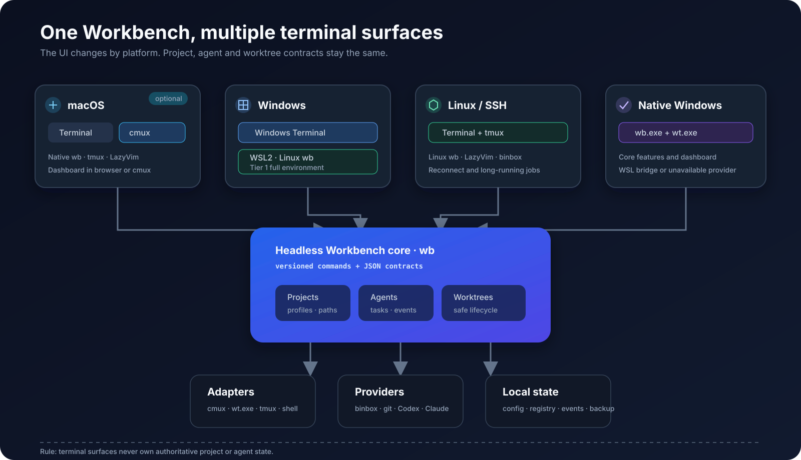

# Personal Workbench 계획 패키지

- 상태: **Phase 2 Slice 2B 로컬 구현 완료, 원격 CI·실장비 smoke 대기**
- 최종 갱신일: 2026-08-05
- 독자: 현재 대화나 이전 장비의 context가 전혀 없는 사람 또는 AI Agent
- 목표: 이 디렉터리만 읽고 Personal Workbench 구현을 안전하게 이어갈 수 있게 한다.

## 지금 알아야 할 결론

현재 `tmux + LazyVim + cmux + binbox` 환경은 폐기하지 않는다. 다음 구조로 점진 진화한다.

```text
dev-env-setup      장비 provisioning, 호환 repo snapshot, 통합 doctor
       │
       ▼
workbench (`wb`)   프로젝트·세션·Agent·worktree의 source of truth
  ├─ cmux adapter  로컬 desktop workspace
  ├─ wt adapter    Windows Terminal tab/pane과 WSL 진입
  ├─ tmux adapter  장시간 세션·SSH·재접속
  ├─ nvim client   LazyVim picker·상태·작업 실행
  ├─ dashboard     localhost Web UI, cmux browser에서도 사용 가능
  └─ binbox        Kubernetes·Terraform·AWS 등 실제 실행 provider
```



이 그림은 목표 책임 경계를 보여준다. 실제 구현 순서와 현재/목표 상태 차이는 아래 문서와 Phase별
수용 기준을 따른다.

중요한 경계:

- Workbench는 cmux 전용이 아니다.
- cmux, Windows Terminal, tmux, 일반 shell, LazyVim, local Web UI는 모두 같은 `wb` core의
  client/backend다.
- Windows에서는 Windows Terminal + WSL을 전체 기능 기본 경로로 사용한다.
- Windows native에서는 `wb.exe` core와 `wt.exe` backend를 지원하고, Bash 기반 binbox 기능은 WSL
  adapter를 통해 실행하거나 unavailable capability로 명시한다.
- 처음부터 별도 desktop 앱을 만들지 않는다.
- 우선 headless CLI와 versioned JSON contract를 만든다.
- UI는 localhost dashboard로 시작하고, 필요가 입증될 때만 Tauri/SwiftUI 앱으로 포장한다.

## 현재 진행 상태

| 항목 | 상태 | 다음 행동 |
|---|---|---|
| 네 repo 구조·결합 분석 | 완료 | 변경 전 baseline commit 재확인 |
| 목표 아키텍처와 대안 비교 | 완료 | Hybrid Workbench를 기본안으로 사용 |
| CLI/API와 데이터 경계 | Phase 1 구현 완료·CI 대기 | push 후 macOS/Linux binbox CI 확인 |
| Desktop/Web UI 방향 | 계획 완료 | core 이후 `wb dashboard` 구현 |
| LazyVim UI 방향 | Phase 1 project client 완료 | Phase 2 core 이후 Agent/worktree picker 구현 |
| Workbench core | Slice 2B 로컬 구현 완료 | Slice 2C worktree 구현 |
| 실제 소스 변경 | Phase 0 완료, Phase 1 CI 대기, Slice 2A·2B 로컬 완료 | push/CI 후 remote·manifest·lock 연결 |

## 읽는 순서

새 세션이나 새 장비에서는 다음 순서로 읽는다.

1. [00-context-and-current-state.md](00-context-and-current-state.md) — 왜 이 계획이 생겼고 현재 무엇이 있는가
2. [01-decisions-and-target-architecture.md](01-decisions-and-target-architecture.md) — 대안과 채택한 기본 방향
3. [02-workbench-cli-and-data-contracts.md](02-workbench-cli-and-data-contracts.md) — `wb` 명령, schema, backend 계약
4. [03-ui-and-client-spec.md](03-ui-and-client-spec.md) — Dashboard, cmux, Windows Terminal, LazyVim UI
5. [04-implementation-roadmap.md](04-implementation-roadmap.md) — 구현 순서와 완료/롤백 조건
6. [05-repository-change-map.md](05-repository-change-map.md) — 각 repo에서 바꿀 파일과 책임
7. [06-validation-security-operations.md](06-validation-security-operations.md) — 테스트, 보안, 운영 기준
8. [07-session-handoff.md](07-session-handoff.md) — context 없이 재개하는 명령과 handoff 문안

## Source of truth 규칙

- 이 디렉터리의 계획은 `plan/README.md`에서 연결된 파일을 기준으로 한다.
- 루트 `WORKBENCH-PLAN.md`는 호환용 진입점이며 내용을 중복 보관하지 않는다.
- 구현 중 결정이 바뀌면 관련 문서와 [01-decisions-and-target-architecture.md](01-decisions-and-target-architecture.md)의
  결정 기록을 함께 갱신한다.
- 코드와 문서가 충돌하면 현재 구현을 사실로 기록하되, 계획 변경 여부는 명시적으로 결정한다.
- 완료되지 않은 항목을 완료로 표시하지 않는다.

## 즉시 시작할 작업

현재 원격 완료 게이트는 **Phase 1 — 구조화 read API의 CI 완료 판정**이다. binbox JSON API와 LazyVim의
비동기 JSON 우선/fallback client는 구현·로컬 commit됐고 WSL contract test가 통과했다. 원격 push 후
기존 binbox macOS/Linux CI에서 새 Bats JSON test를 확인해야 Phase 1을 완료로 판정한다.

사용자가 push를 추후 직접 하기로 결정하고 로컬 진행을 명시 승인하여, 이 게이트를 완료 처리하지 않은 채
`workbench` Slice 2A와 2B를 선행 구현했다. 로컬 repo의 `84ba289`, `7ddc5d3`, `6712279`에 Go baseline,
schema-v1 project registry, strict TOML validation, XDG/Windows 경로, JSON read API, sessionizer migration,
backend contract와 `wb open`이 있다. shell/tmux/cmux/Windows Terminal·WSL adapter의 selector와 argument-array
계약을 test했고 Linux race/vet, macOS/Windows cross-test와 build를 통과했다.

착수 전:

```bash
cd ~/home/setup
git pull --ff-only
./doctor.sh

git -C binbox status --short
git -C nvim status --short
git -C cmux-config status --short
```

Windows/WSL에서는 cmux가 없는 것이 정상이며 `windows-wsl` profile이 자동으로 disabled/skipped 처리한다.
다음을 공통 baseline 증거로 남긴다.

```bash
./bootstrap.sh --show-selection
./bootstrap.sh --no-pull
./binbox/bb list
test -e "$HOME/.config/nvim"
git -C binbox status --short
git -C nvim status --short
./doctor.sh
./tests/contract-test.sh
```

`bootstrap.sh` 출력에 required setup warning이 없어야 하고, `bb list`, nvim link, aggregate doctor,
contract test가 성공해야 한다. cmux disabled/skipped는 failure가 아니다.

다음 로컬 구현 단위는 [04-implementation-roadmap.md](04-implementation-roadmap.md)의 Slice 2C
worktree registry와 dirty/conflict safety다. 다만 신규 `workbench` remote, platform manifest, `locks/repos.lock`은
repo가 실제로 생성·push되기 전까지 연결하지 않는다. Phase 1과 Workbench의 원격 CI 결과가 없으므로
formal completion 표시는 계속 보류한다.

## 범위 제외

현재 계획에서 의도적으로 제외한다.

- Orca 또는 다른 상용 Agent IDE로 전체 환경 교체
- 외부 네트워크에 노출되는 Workbench server
- 팀/조직용 multi-user 권한 모델
- arbitrary shell command를 Dashboard에서 자유 입력·실행하는 기능
- 처음부터 상시 daemon 또는 cloud synchronization 도입

필요성이 확인되면 별도 결정 기록을 만든 뒤 범위를 확장한다.
